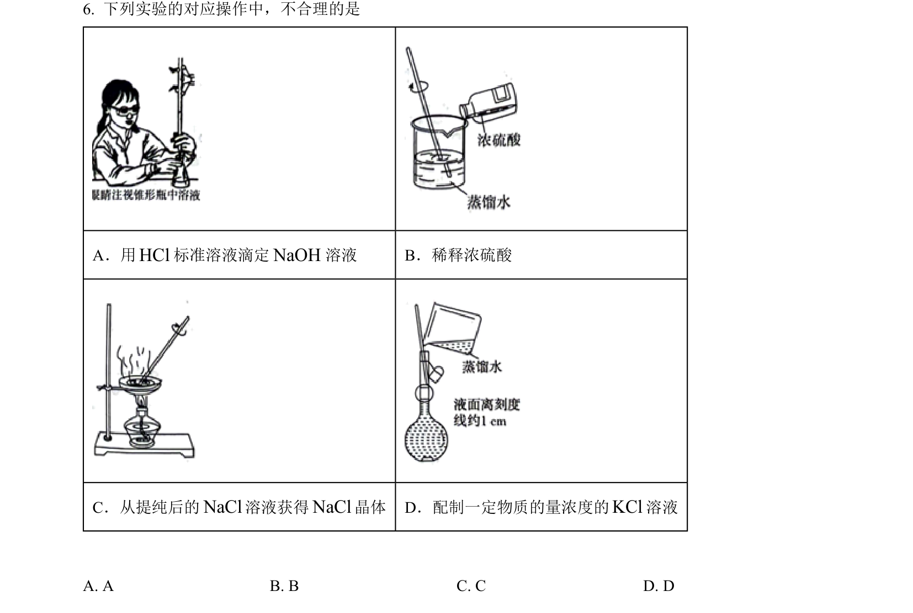
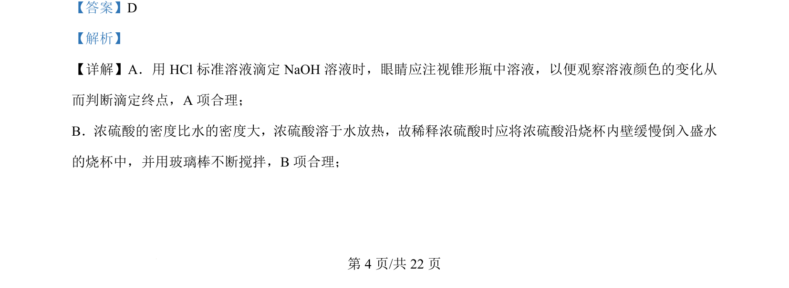
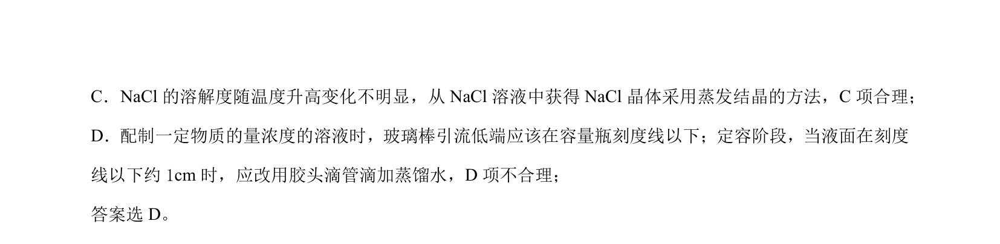

## 题面

## 摘要

考查化学实验基本操作的正误判断

## 关联考点

- [[滴定操作]]
- [[140-浓硫酸稀释|浓硫酸稀释]]
- [[090-蒸发结晶|蒸发结晶]]
- [[522-一定物质的量浓度溶液配制|一定物质的量浓度溶液配制]]

## 答案与解析

> 📄 原 PDF 第 4 页：`素材/真题/北京/2008-2024·（北京）化学高考真题/2024年高考化学试卷（北京）（解析卷）.pdf`
