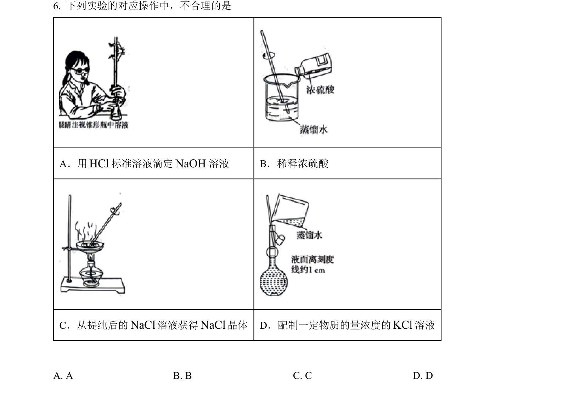
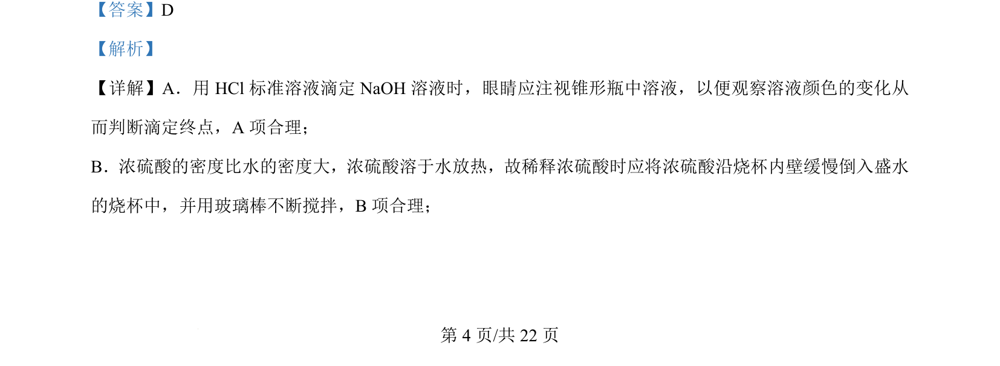
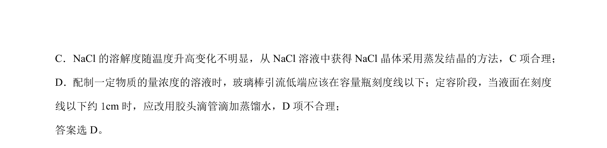

## 题面

## 摘要

考查化学实验基本操作的正误判断

## 关联考点

- [[滴定操作]]
- [[140-浓硫酸稀释|浓硫酸稀释]]
- [[090-蒸发结晶|蒸发结晶]]
- [[908-一定物质的量浓度溶液的配制|一定物质的量浓度溶液配制]]

## 答案与解析

> 📄 原 PDF 第 4 页：`素材/真题/北京/2008-2024·（北京）化学高考真题/2024年高考化学试卷（北京）（解析卷）.pdf`

<!-- 题干文本-start -->
## 题干文本
6. 下列实验的对应操作中，不合理的是
A．用HCl标准溶液滴定NaOH溶液 B．稀释浓硫酸
C．从提纯后的NaCl溶液获得NaCl晶体 D．配制一定物质的量浓度的KCl溶液
A. A B. B C. C D. D
<!-- 题干文本-end -->

<!-- 解析文本-start -->
## 解析文本
【答案】D
【解析】
【详解】A．用 HCl 标准溶液滴定 NaOH 溶液时，眼睛应注视锥形瓶中溶液，以便观察溶液颜色的变化从
而判断滴定终点，A 项合理；
B．浓硫酸的密度比水的密度大，浓硫酸溶于水放热，故稀释浓硫酸时应将浓硫酸沿烧杯内壁缓慢倒入盛水
的烧杯中，并用玻璃棒不断搅拌，B项合理；
<!-- 解析文本-end -->
