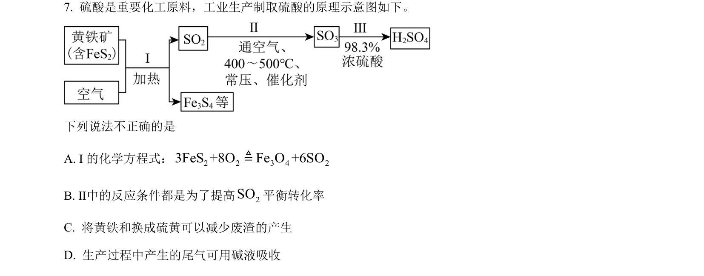
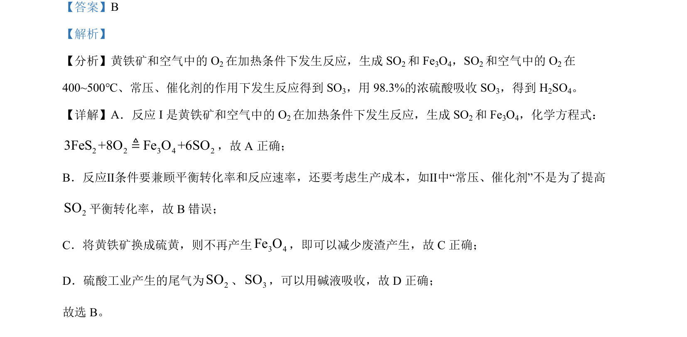

## 题面

## 摘要

该题考查接触法制硫酸的工艺流程，涉及黄铁矿焙烧、催化氧化、吸收等步骤及条件分析。

## 关联考点

- [[219-接触法制硫酸|接触法制硫酸]]
- [[化学方程式正误判断]]
- [[化学反应速率与平衡]]
- [[279-绿色化学|绿色化学]]

## 答案与解析

> 📄 原 PDF 第 5 页：`素材/真题/北京/2008-2024·（北京）化学高考真题/2024年高考化学试卷（北京）（解析卷）.pdf`
