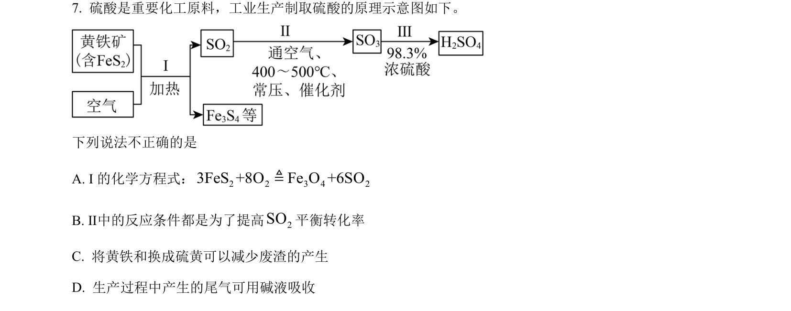
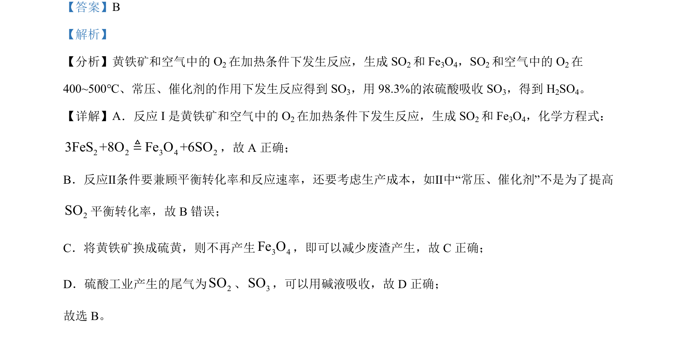

## 题面

## 摘要

该题考查接触法制硫酸的工艺流程，涉及黄铁矿焙烧、催化氧化、吸收等步骤及条件分析。

## 关联考点

- [[219-接触法制硫酸|接触法制硫酸]]
- [[化学方程式正误判断]]
- [[化学反应速率与平衡]]
- [[279-绿色化学|绿色化学]]

## 答案与解析

> 📄 原 PDF 第 5 页：`素材/真题/北京/2008-2024·（北京）化学高考真题/2024年高考化学试卷（北京）（解析卷）.pdf`

<!-- 题干文本-start -->
## 题干文本
7. 硫酸是重要化工原料，工业生产制取硫酸的原理示意图如下。
下列说法不正确的是
A. I 的化学方程式：2 2 3 4 23FeS +8O Fe O +6SO@
B. Ⅱ中的反应条件都是为了提高2SO平衡转化率
C. 将黄铁和换成硫黄可以减少废渣的产生
D. 生产过程中产生的尾气可用碱液吸收
<!-- 题干文本-end -->

<!-- 解析文本-start -->
## 解析文本
【答案】B
【解析】
【分析】黄铁矿和空气中的 O2在加热条件下发生反应，生成 SO2和 Fe3O4，SO2和空气中的 O2在
400~500℃、常压、催化剂的作用下发生反应得到 SO3，用 98.3%的浓硫酸吸收 SO3，得到 H2SO4。
【详解】A．反应 I 是黄铁矿和空气中的 O2在加热条件下发生反应，生成 SO2和 Fe3O4，化学方程式：
2 2 3 4 23FeS +8O Fe O +6SO@，故 A 正确；
B．反应Ⅱ条件要兼顾平衡转化率和反应速率，还要考虑生产成本，如Ⅱ中“常压、催化剂”不是为了提高
2SO平衡转化率，故 B错误；
C．将黄铁矿换成硫黄，则不再产生3 4Fe O，即可以减少废渣产生，故 C正确；
D．硫酸工业产生的尾气为2SO、3SO，可以用碱液吸收，故 D 正确；
故选 B。
<!-- 解析文本-end -->
