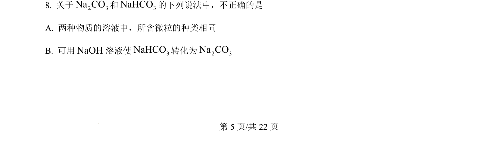
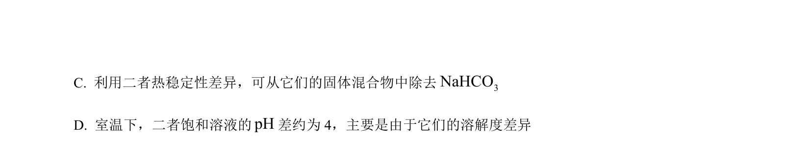
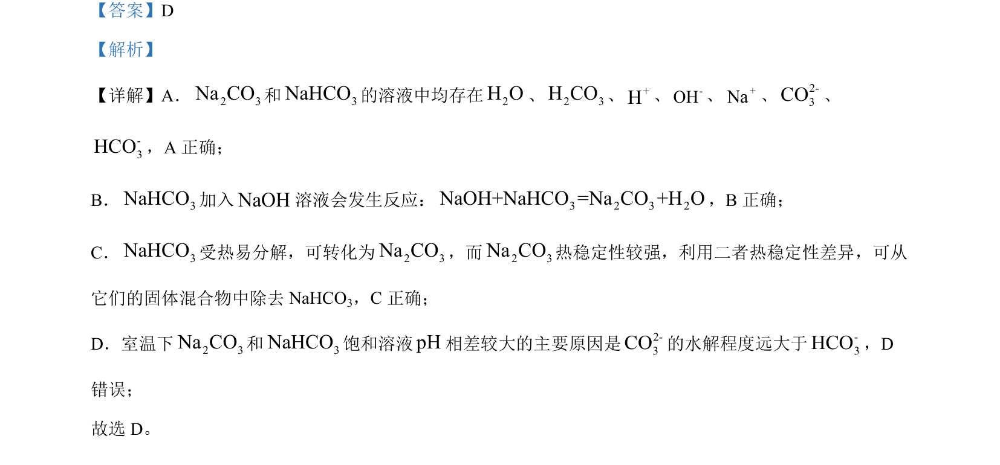

## 题面

## 摘要

比较Na₂CO₃与NaHCO₃的溶液离子组成、反应、热稳定性及pH差异原因，并涉及氘代氨的制备区分方法

## 关联考点

- [[碳酸钠与碳酸氢钠的性质比较]]
- [[336-盐类水解|盐类水解]]
- [[980-热稳定性|热稳定性]]
- [[983-质谱法|质谱法]]

## 答案与解析

> 📄 原 PDF 第 5 页：`素材/真题/北京/2008-2024·（北京）化学高考真题/2024年高考化学试卷（北京）（解析卷）.pdf`
