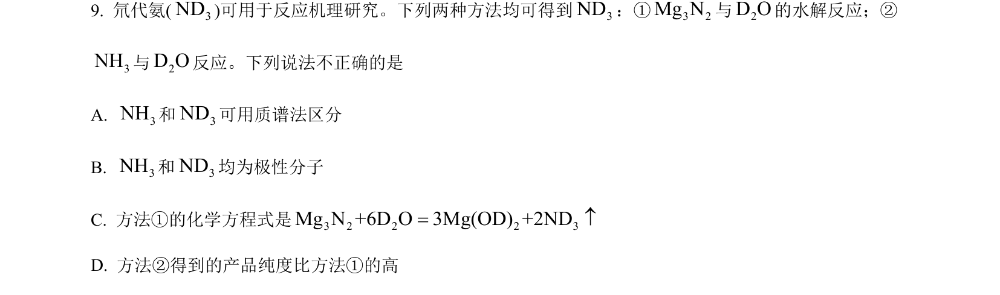
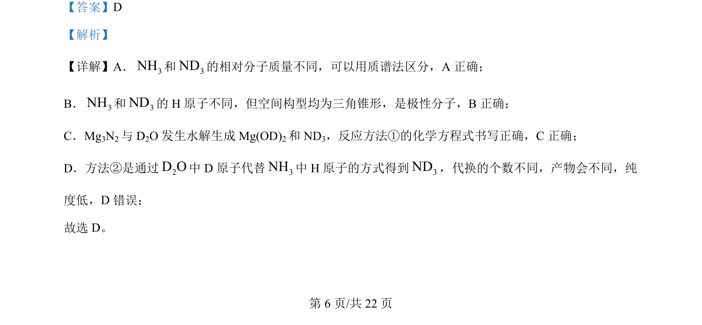

## 题面

## 摘要

该题通过NH₃与ND₃的对比判断，考查质谱法区分同位素分子、分子极性及水解反应方程式正误。

## 关联考点

- [[983-质谱法|质谱法]]
- [[256-分子的极性|极性分子]]
- [[742-水解反应|水解反应]]
- [[同位素取代]]

## 答案与解析

> 📄 原 PDF 第 6 页：`素材/真题/北京/2008-2024·（北京）化学高考真题/2024年高考化学试卷（北京）（解析卷）.pdf`
