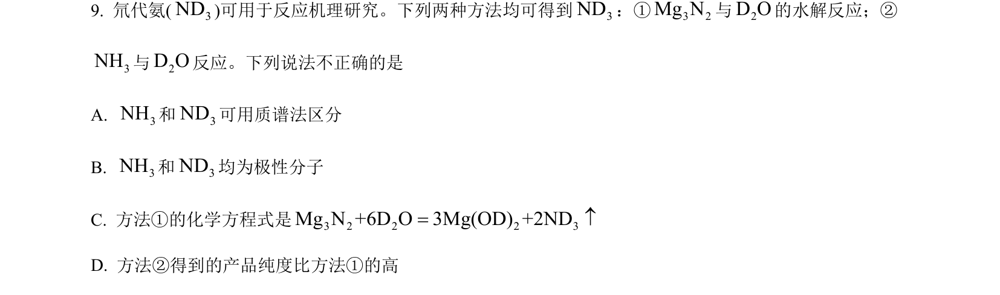
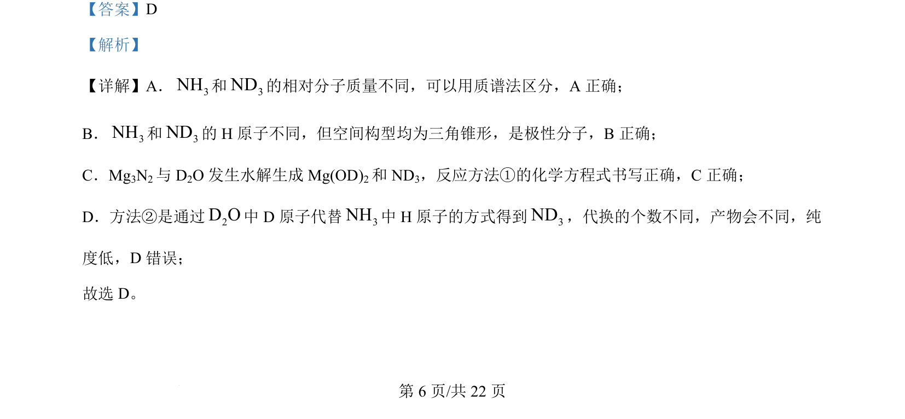

## 题面

## 摘要

该题通过NH₃与ND₃的对比判断，考查质谱法区分同位素分子、分子极性及水解反应方程式正误。

## 关联考点

- [[983-质谱法|质谱法]]
- [[256-分子的极性|极性分子]]
- [[742-水解反应|水解反应]]
- [[同位素取代]]

## 答案与解析

> 📄 原 PDF 第 6 页：`素材/真题/北京/2008-2024·（北京）化学高考真题/2024年高考化学试卷（北京）（解析卷）.pdf`

<!-- 题干文本-start -->
## 题干文本
9. 氘代氨(3ND)可用于反应机理研究。下列两种方法均可得到3ND：①3 2Mg N与2D O的水解反应；②
3NH与2D O反应。下列说法不正确的是
A. 3NH和3ND可用质谱法区分
B. 3NH和3ND均为极性分子
C. 方法①的化学方程式是3 2 2 2 3Mg N +6D O 3Mg(OD) +2ND= ­
D. 方法②得到的产品纯度比方法①的高
<!-- 题干文本-end -->

<!-- 解析文本-start -->
## 解析文本
【答案】D
【解析】
【详解】A．3NH和3ND的相对分子质量不同，可以用质谱法区分，A 正确；
B．3NH和3ND的 H 原子不同，但空间构型均为三角锥形，是极性分子，B正确；
C．Mg3N2与 D2O 发生水解生成 Mg(OD)2和 ND3，反应方法①的化学方程式书写正确，C正确；
D．方法②是通过2D O中 D 原子代替3NH中 H 原子的方式得到3ND，代换的个数不同，产物会不同，纯
度低，D 错误；
故选 D。
<!-- 解析文本-end -->
