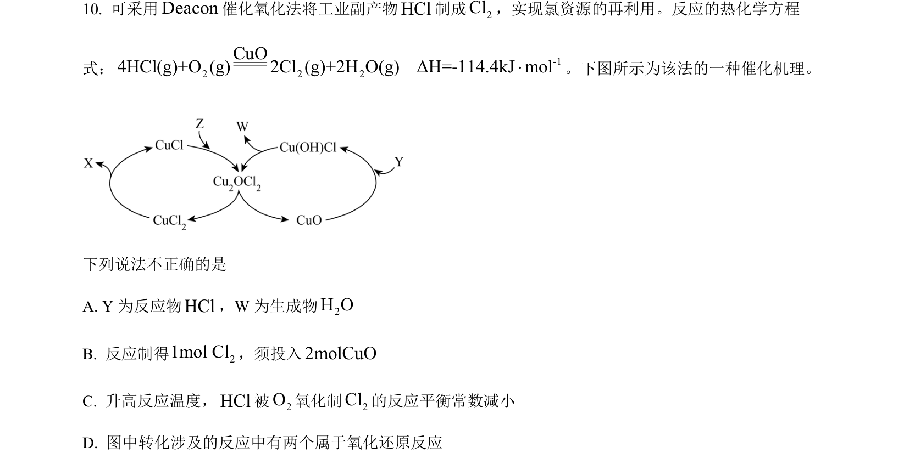
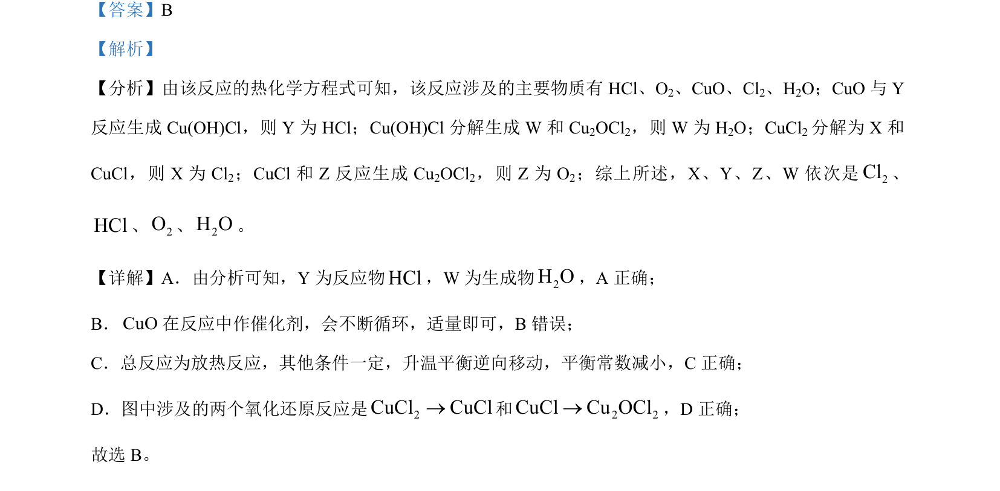

## 题面

## 摘要

推断反应流程中物质X、Y、Z、W并分析相关反应原理

## 关联考点

- [[化学反应原理]]
- [[162-氧化还原反应|氧化还原反应]]
- [[039-催化剂|催化剂]]
- [[349-平衡移动|平衡移动]]

## 答案与解析

> 📄 原 PDF 第 7 页：`素材/真题/北京/2008-2024·（北京）化学高考真题/2024年高考化学试卷（北京）（解析卷）.pdf`

<!-- 题干文本-start -->
## 题干文本
10. 可采用Deacon催化氧化法将工业副产物HCl制成2Cl，实现氯资源的再利用。反应的热化学方程
式： -12 2 2CuO4HCl(g)+O (g) 2Cl (g)+2H O(g)ΔH=-114.4kJ mol×。下图所示为该法的一种催化机理。
下列说法不正确的是
A. Y 为反应物HCl，W为生成物2H O
B. 反应制得 21mol Cl，须投入2molCuO
C. 升高反应温度，HCl被2O氧化制2Cl的反应平衡常数减小
D. 图中转化涉及的反应中有两个属于氧化还原反应
<!-- 题干文本-end -->

<!-- 解析文本-start -->
## 解析文本
【答案】B
【解析】
【分析】由该反应的热化学方程式可知，该反应涉及的主要物质有 HCl、O2、CuO、Cl2、H2O；CuO 与 Y
反应生成 Cu(OH)Cl，则 Y 为 HCl；Cu(OH)Cl 分解生成 W 和 Cu2OCl2，则 W 为 H2O；CuCl2分解为 X 和
CuCl，则 X 为 Cl2；CuCl 和 Z 反应生成 Cu2OCl2，则 Z 为 O2；综上所述， X、Y、Z、W 依次是2Cl、
HCl、2O、2H O。
【详解】A．由分析可知，Y 为反应物HCl，W为生成物2H O，A 正确；
B．CuO在反应中作催化剂，会不断循环，适量即可，B错误；
C．总反应为放热反应，其他条件一定，升温平衡逆向移动，平衡常数减小，C正确；
D．图中涉及的两个氧化还原反应是2CuCl CuCl®和 2 2CuCl Cu OCl®，D 正确；
故选 B。
<!-- 解析文本-end -->
