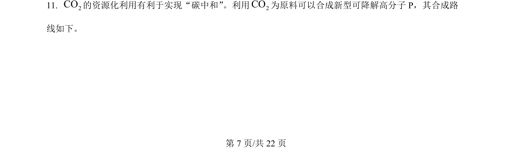
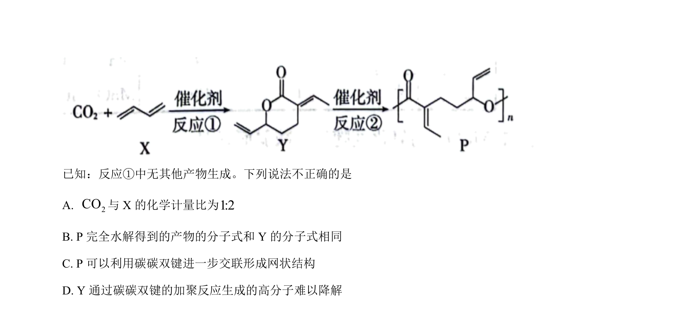
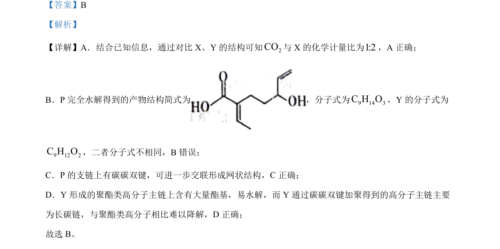

## 题面

## 摘要

考查化学平衡方向、弱酸电离、元素周期律及氢化物热稳定性判断

## 关联考点

- [[342-化学平衡常数|化学平衡常数]]
- [[685-弱酸电离平衡|弱酸电离平衡]]
- [[391-电负性|电负性]]
- [[393-第一电离能|第一电离能]]
- [[315-键能|键能]]

## 答案与解析

> 📄 原 PDF 第 7 页：`素材/真题/北京/2008-2024·（北京）化学高考真题/2024年高考化学试卷（北京）（解析卷）.pdf`
