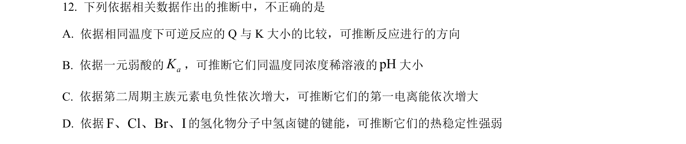
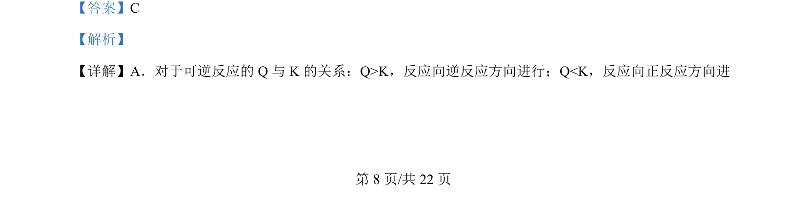
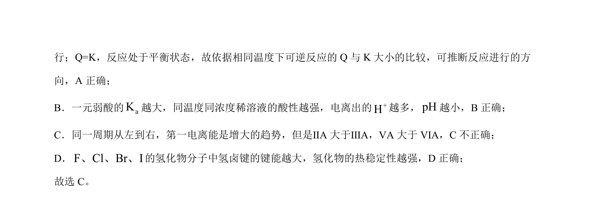

## 题面

## 摘要

考查可逆反应方向判断、弱酸Ka与酸性、第一电离能周期性和氢化物稳定性等基本概念辨析

## 关联考点

- [[可逆反应方向判断]]
- [[弱酸电离常数]]
- [[第一电离能周期性]]
- [[977-氢化物稳定性|氢化物稳定性]]

## 答案与解析

> 📄 原 PDF 第 8 页：`素材/真题/北京/2008-2024·（北京）化学高考真题/2024年高考化学试卷（北京）（解析卷）.pdf`
