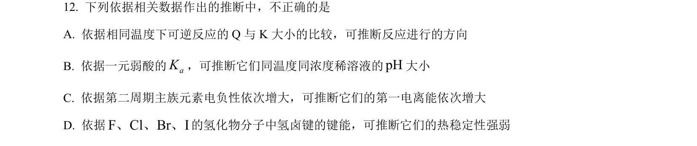
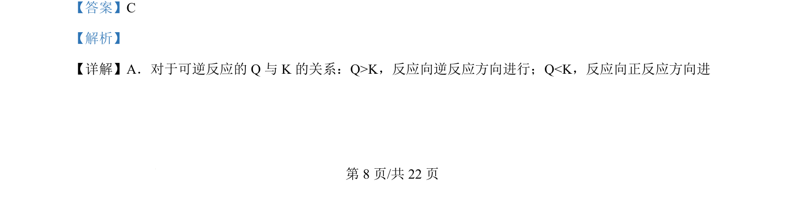
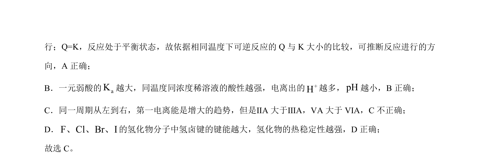

## 题面

## 摘要

考查可逆反应方向判断、弱酸Ka与酸性、第一电离能周期性和氢化物稳定性等基本概念辨析

## 关联考点

- [[可逆反应方向判断]]
- [[弱酸电离常数]]
- [[第一电离能周期性]]
- [[977-氢化物稳定性|氢化物稳定性]]

## 答案与解析

> 📄 原 PDF 第 8 页：`素材/真题/北京/2008-2024·（北京）化学高考真题/2024年高考化学试卷（北京）（解析卷）.pdf`

<!-- 题干文本-start -->
## 题干文本
12. 下列依据相关数据作出的推断中，不正确的是
A. 依据相同温度下可逆反应的 Q 与 K 大小的比较，可推断反应进行的方向
B. 依据一元弱酸的aK，可推断它们同温度同浓度稀溶液的pH大小
C. 依据第二周期主族元素电负性依次增大，可推断它们的第一电离能依次增大
D. 依据F Cl Br I、、、的氢化物分子中氢卤键的键能，可推断它们的热稳定性强弱
<!-- 题干文本-end -->

<!-- 解析文本-start -->
## 解析文本
【答案】C
【解析】
【详解】A．对于可逆反应的 Q 与 K 的关系：Q>K，反应向逆反应方向进行；Q<K，反应向正反应方向进
<!-- 解析文本-end -->
