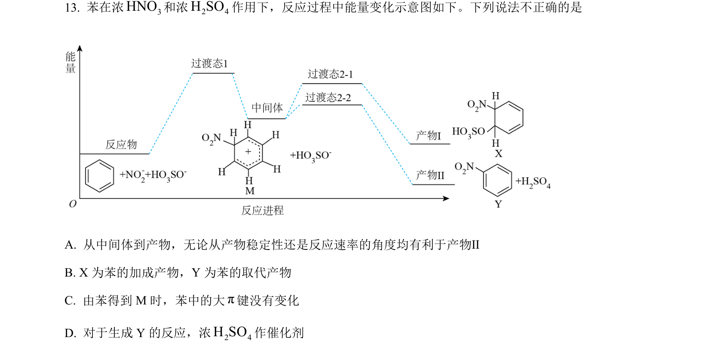
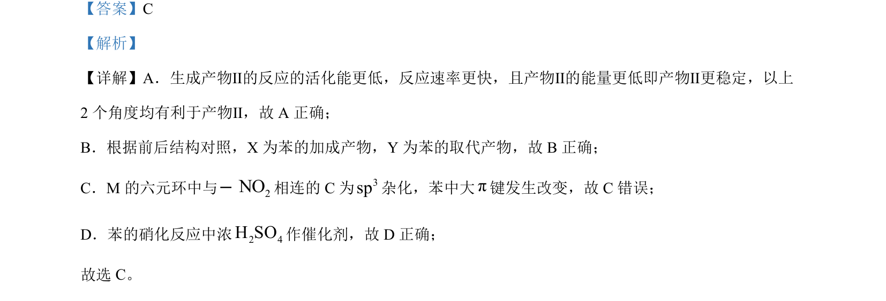

## 题面

## 摘要

本题考查有机反应中活化能与产物稳定性关系、加成与取代产物判断及杂化方式分析。

## 关联考点

- [[351-活化能|活化能]]
- [[产物稳定性]]
- [[421-sp3杂化|sp3杂化]]
- [[加成与取代]]

## 答案与解析

> 📄 原 PDF 第 9 页：`素材/真题/北京/2008-2024·（北京）化学高考真题/2024年高考化学试卷（北京）（解析卷）.pdf`
