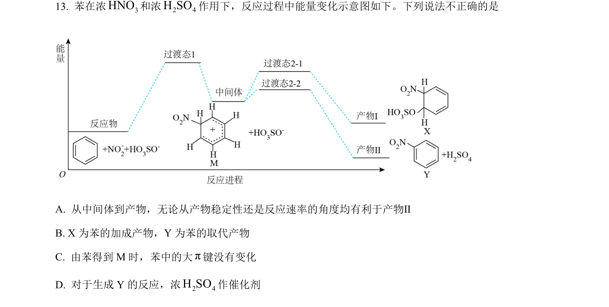
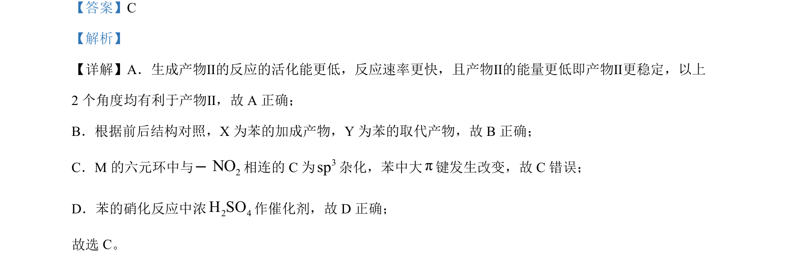

## 题面

## 摘要

本题考查有机反应中活化能与产物稳定性关系、加成与取代产物判断及杂化方式分析。

## 关联考点

- [[351-活化能|活化能]]
- [[产物稳定性]]
- [[421-sp3杂化|sp3杂化]]
- [[加成与取代]]

## 答案与解析

> 📄 原 PDF 第 9 页：`素材/真题/北京/2008-2024·（北京）化学高考真题/2024年高考化学试卷（北京）（解析卷）.pdf`

<!-- 题干文本-start -->
## 题干文本
13. 苯在浓 3HNO和浓2 4H SO作用下，反应过程中能量变化示意图如下。下列说法不正确的是
A. 从中间体到产物，无论从产物稳定性还是反应速率的角度均有利于产物Ⅱ
B. X 为苯的加成产物，Y 为苯的取代产物
C. 由苯得到 M 时，苯中的大π键没有变化
D. 对于生成 Y 的反应，浓2 4H SO作催化剂
<!-- 题干文本-end -->

<!-- 解析文本-start -->
## 解析文本
【答案】C
【解析】
【详解】A．生成产物Ⅱ的反应的活化能更低，反应速率更快，且产物Ⅱ的能量更低即产物Ⅱ更稳定，以上
2 个角度均有利于产物Ⅱ，故 A 正确；
B．根据前后结构对照，X 为苯的加成产物，Y 为苯的取代产物，故 B正确；
C．M 的六元环中与 2NO—相连的 C为3sp杂化，苯中大π键发生改变，故 C错误；
D．苯的硝化反应中浓2 4H SO作催化剂，故 D 正确；
故选 C。
<!-- 解析文本-end -->
