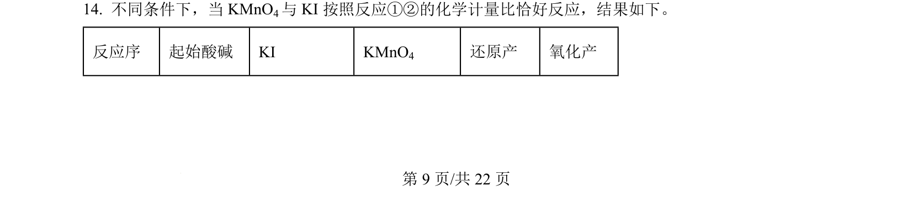
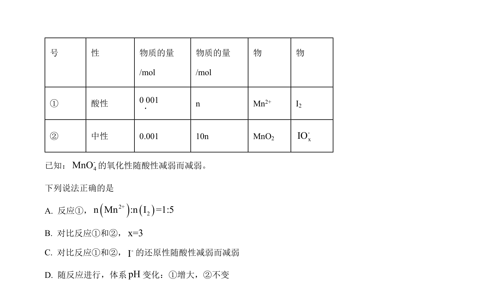
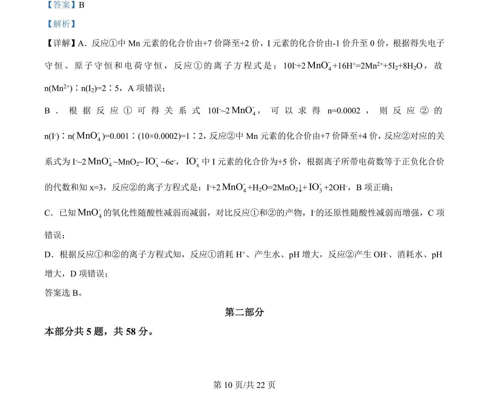

## 题面

## 摘要

考查氧化还原反应离子方程式书写、化合价判断及VSEPR模型

## 关联考点

- [[162-氧化还原反应|氧化还原反应]]
- [[170-离子方程式|离子方程式]]
- [[028-化合价|化合价]]
- [[584-VSEPR模型|VSEPR模型]]

## 答案与解析

> 📄 原 PDF 第 9 页：`素材/真题/北京/2008-2024·（北京）化学高考真题/2024年高考化学试卷（北京）（解析卷）.pdf`
