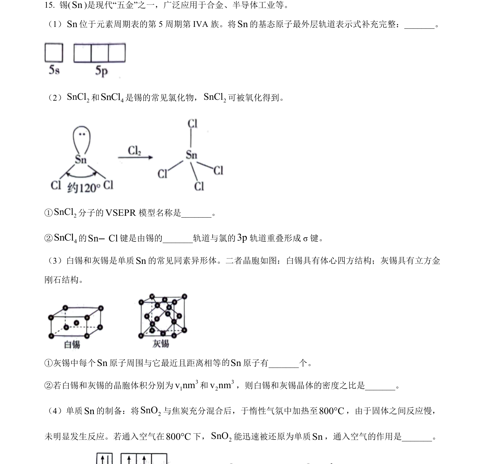
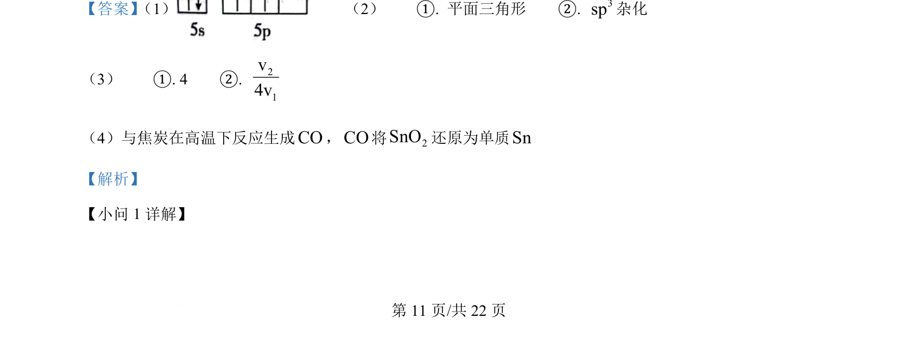
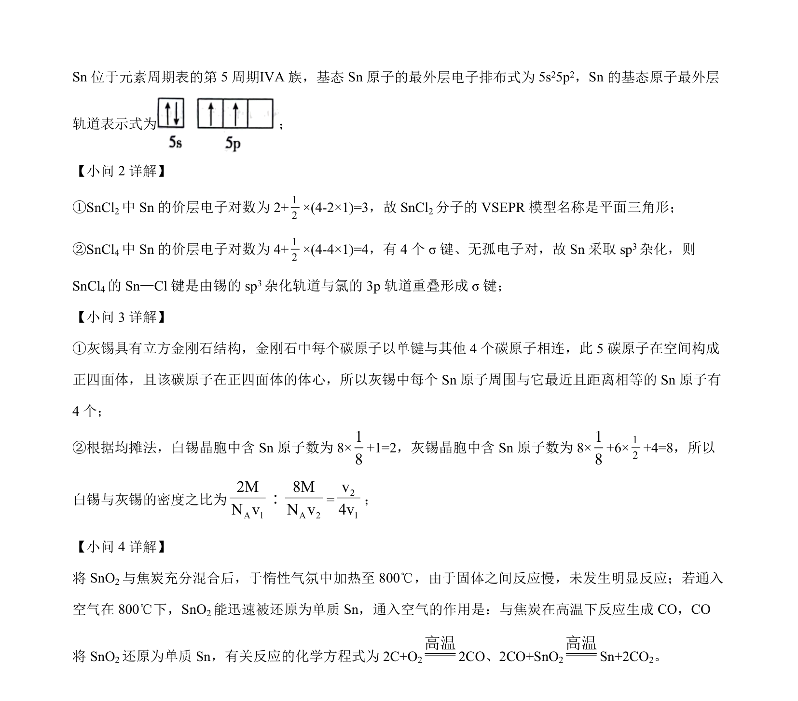

## 题面

## 摘要

本题主要考查原子结构与轨道表示式、分子空间构型与杂化方式、晶胞结构与密度计算及氧化还原反应原理。

## 关联考点

- [[426-原子结构|原子结构]]
- [[027-分子|分子结构]]
- [[晶体结构]]
- [[162-氧化还原反应|氧化还原反应]]

## 答案与解析

> 📄 原 PDF 第 11 页：`素材/真题/北京/2008-2024·（北京）化学高考真题/2024年高考化学试卷（北京）（解析卷）.pdf`
