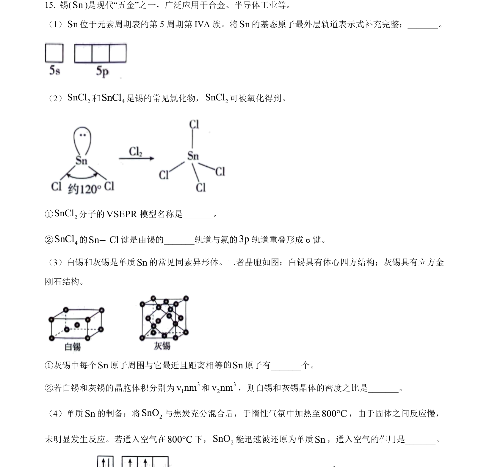
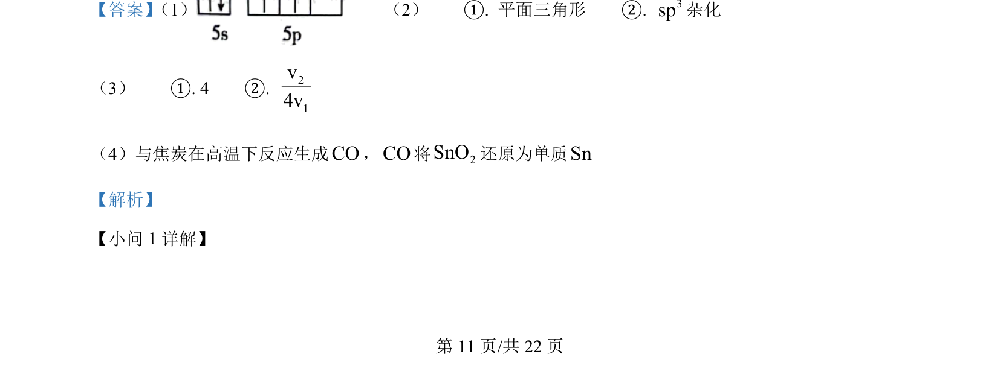
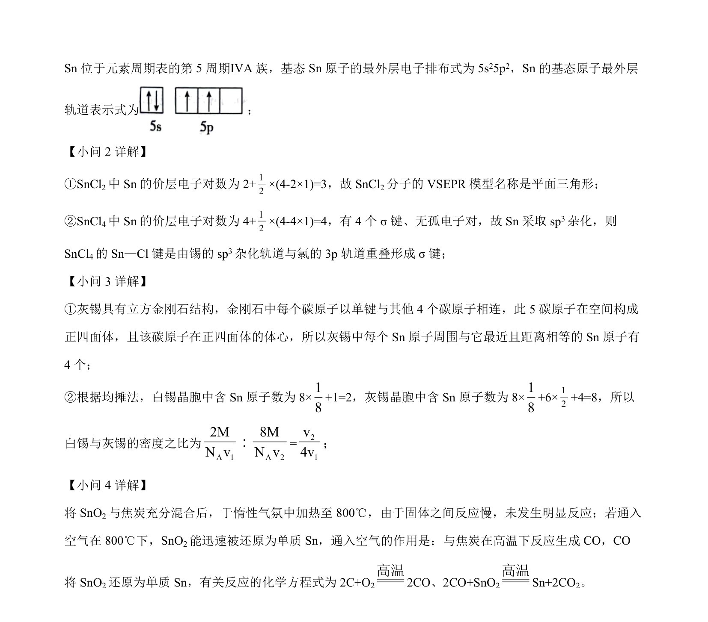

## 题面

## 摘要

本题主要考查原子结构与轨道表示式、分子空间构型与杂化方式、晶胞结构与密度计算及氧化还原反应原理。

## 关联考点

- [[426-原子结构|原子结构]]
- [[027-分子|分子结构]]
- [[晶体结构]]
- [[162-氧化还原反应|氧化还原反应]]

## 答案与解析

> 📄 原 PDF 第 11 页：`素材/真题/北京/2008-2024·（北京）化学高考真题/2024年高考化学试卷（北京）（解析卷）.pdf`

<!-- 题干文本-start -->
## 题干文本
15. 锡(Sn)是现代“五金”之一，广泛应用于合金、半导体工业等。
（1）Sn位于元素周期表的第 5 周期第 IVA 族。将Sn的基态原子最外层轨道表示式补充完整：_______。
（2）2SnCl和4SnCl是锡的常见氯化物，2SnCl可被氧化得到。
①2SnCl分子的VSEPR模型名称是_______。
②4SnCl的Sn Cl—键是由锡的_______轨道与氯的3p轨道重叠形成 σ 键。
（3）白锡和灰锡是单质Sn的常见同素异形体。二者晶胞如图：白锡具有体心四方结构；灰锡具有立方金
刚石结构。
①灰锡中每个Sn原子周围与它最近且距离相等Sn原子有_______个。
②若白锡和灰锡的晶胞体积分别为31v nm和 32v nm，则白锡和灰锡晶体的密度之比是_______。
（4）单质Sn的制备：将2SnO与焦炭充分混合后，于惰性气氛中加热至800 C°，由于固体之间反应慢，
未明显发生反应。若通入空气在800 C°下，2SnO能迅速被还原为单质Sn，通入空气的作用是_______。
<!-- 题干文本-end -->

<!-- 解析文本-start -->
## 解析文本
【答案】 （1）     （2）    ①. 平面三角形    ②. 3sp杂化    
（3）    ①. 4    ②. 21v4v    
（4）与焦炭在高温下反应生成CO，CO将2SnO还原为单质Sn
【解析】
【小问 1 详解】
的
<!-- 解析文本-end -->
