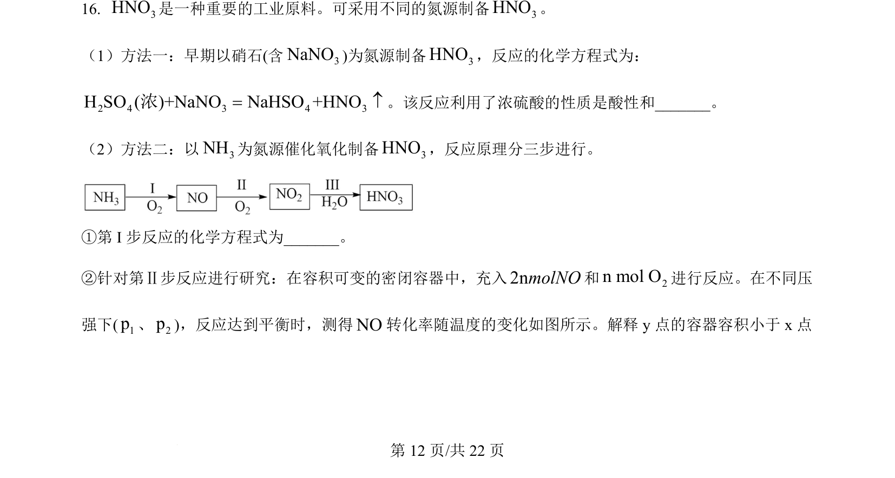
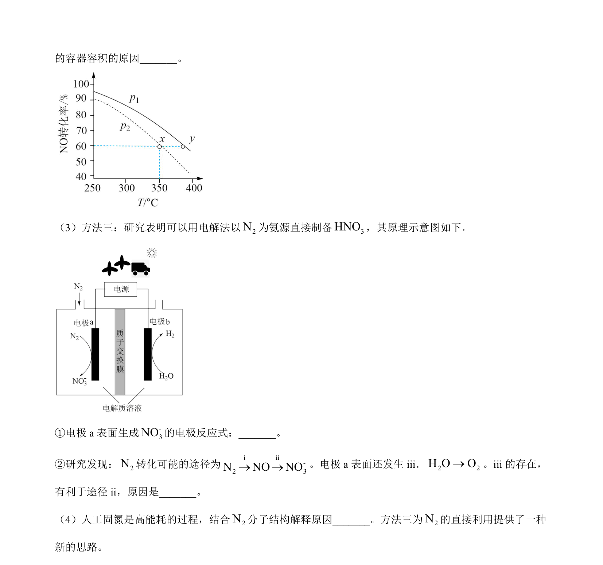
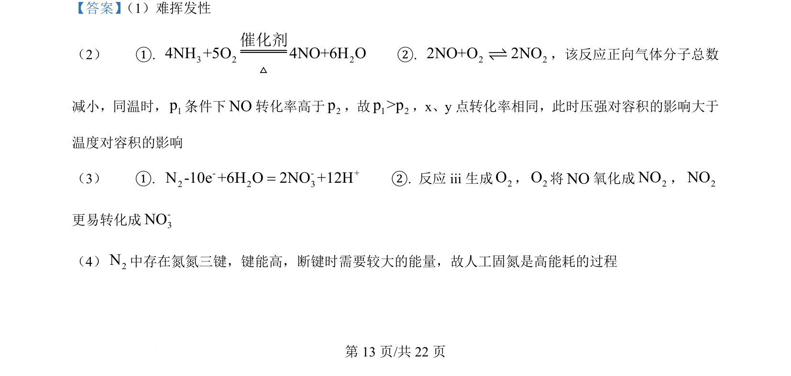
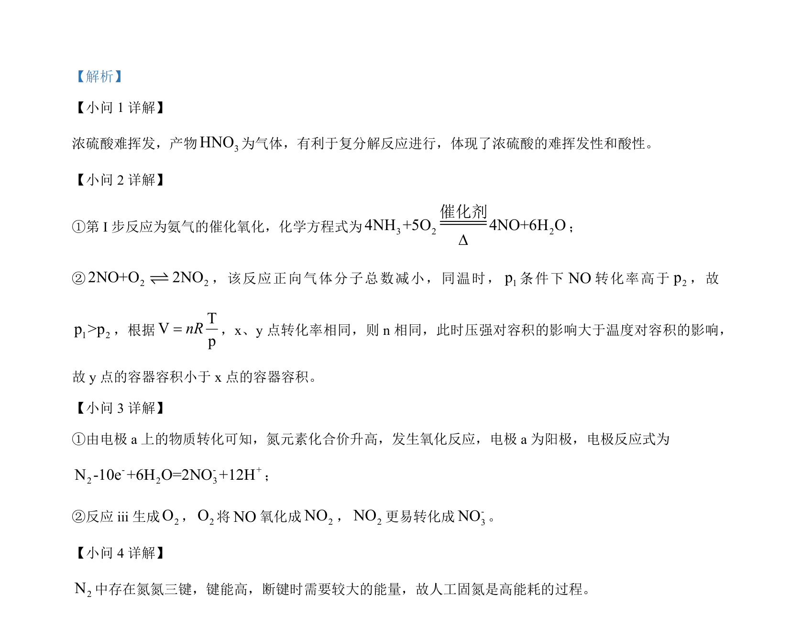

## 题面

## 摘要

考查浓硫酸性质、氨催化氧化、化学平衡、电解池阳极反应及有机合成推断

## 关联考点

- [[223-浓硫酸性质|浓硫酸性质]]
- [[284-化学平衡|化学平衡]]
- [[电解池阳极反应]]
- [[709-有机合成推断|有机合成推断]]

## 答案与解析

> 📄 原 PDF 第 12 页：`素材/真题/北京/2008-2024·（北京）化学高考真题/2024年高考化学试卷（北京）（解析卷）.pdf`
