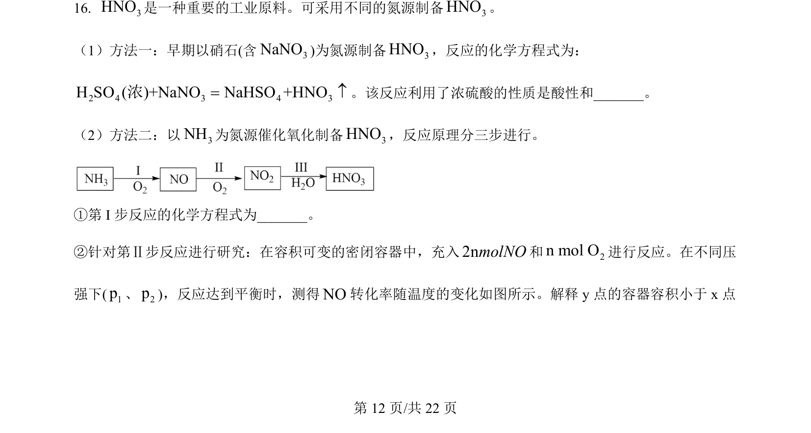
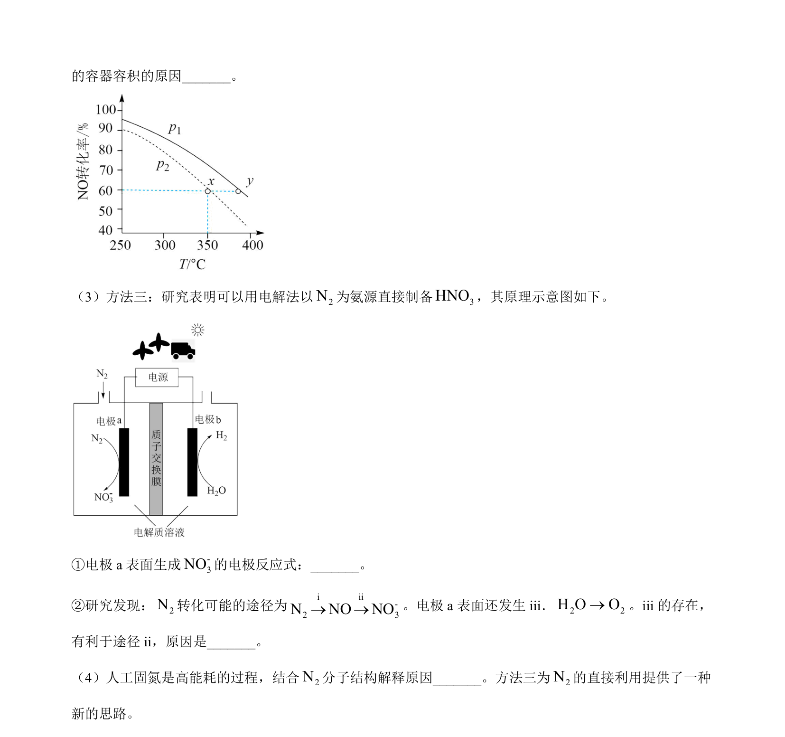
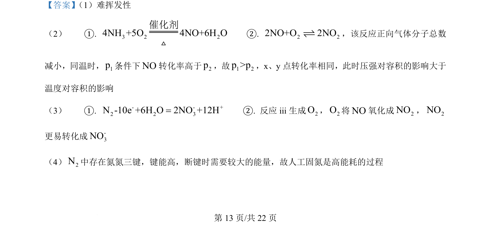
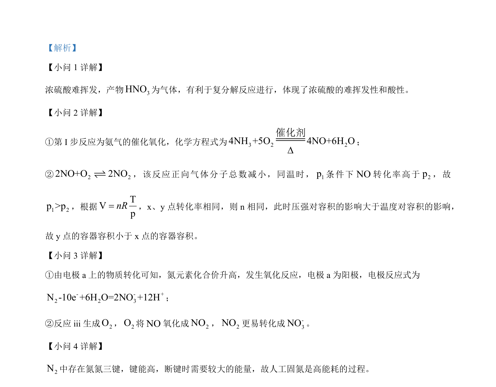

## 题面

## 摘要

考查浓硫酸性质、氨催化氧化、化学平衡、电解池阳极反应及有机合成推断

## 关联考点

- [[223-浓硫酸性质|浓硫酸性质]]
- [[284-化学平衡|化学平衡]]
- [[电解池阳极反应]]
- [[709-有机合成推断|有机合成推断]]

## 答案与解析

> 📄 原 PDF 第 12 页：`素材/真题/北京/2008-2024·（北京）化学高考真题/2024年高考化学试卷（北京）（解析卷）.pdf`

<!-- 题干文本-start -->
## 题干文本
16. 3HNO是一种重要的工业原料。可采用不同的氮源制备 3HNO。
（1）方法一：早期以硝石(含 3NaNO)为氮源制备 3HNO，反应的化学方程式为：
2 4 3 4 3H SO ( )+NaNO NaHSO +HNO= ­浓。该反应利用了浓硫酸的性质是酸性和_______。
（2）方法二：以3NH为氮源催化氧化制备 3HNO，反应原理分三步进行。
①第 I 步反应的化学方程式为_______。
②针对第Ⅱ步反应进行研究：在容积可变的密闭容器中，充入2nmolNO和 2n mol O进行反应。在不同压
强下(1p、2p)，反应达到平衡时，测得NO转化率随温度的变化如图所示。解释 y 点的容器容积小于 x 点
<!-- 题干文本-end -->

<!-- 解析文本-start -->
## 解析文本

<!-- 解析文本-end -->
