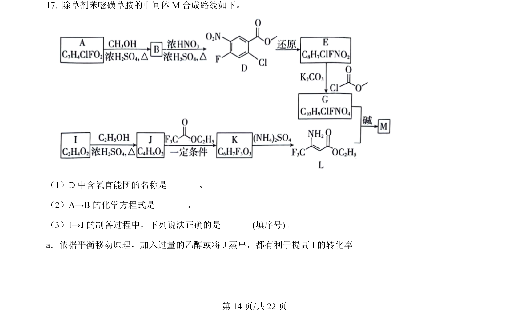
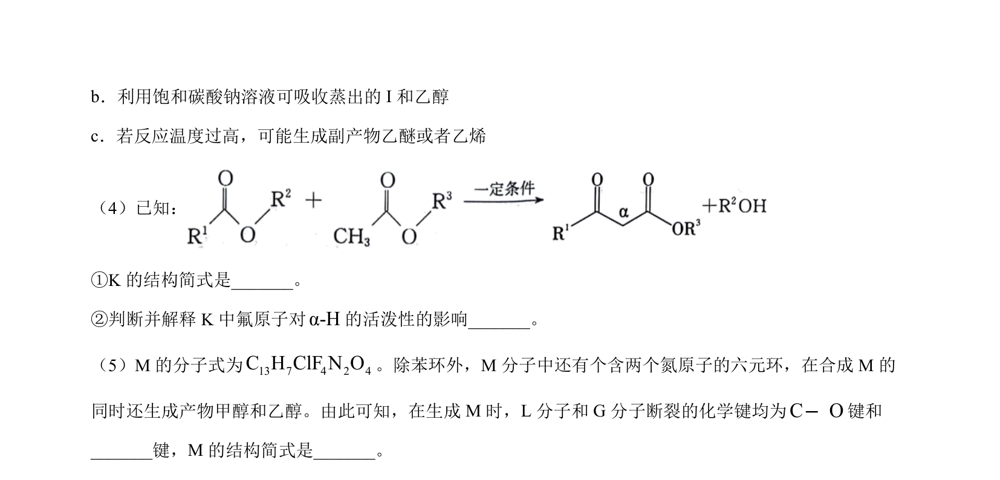
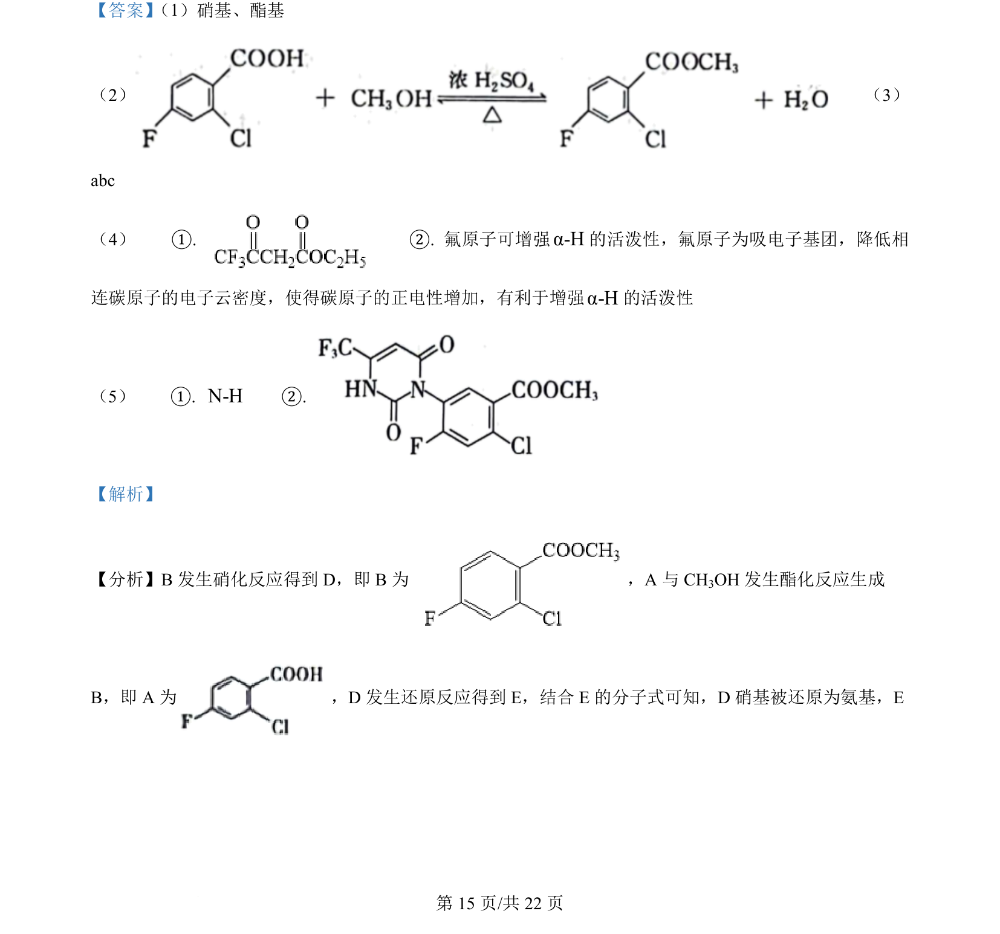
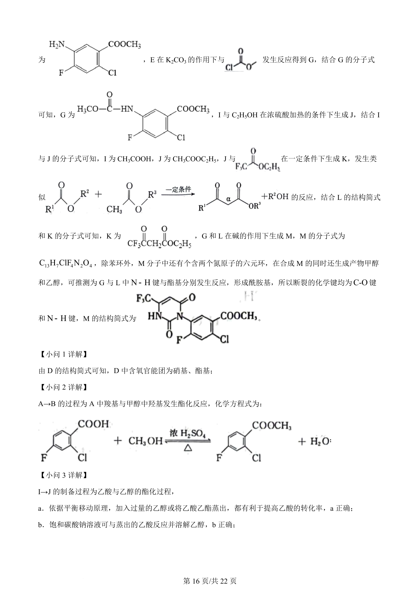
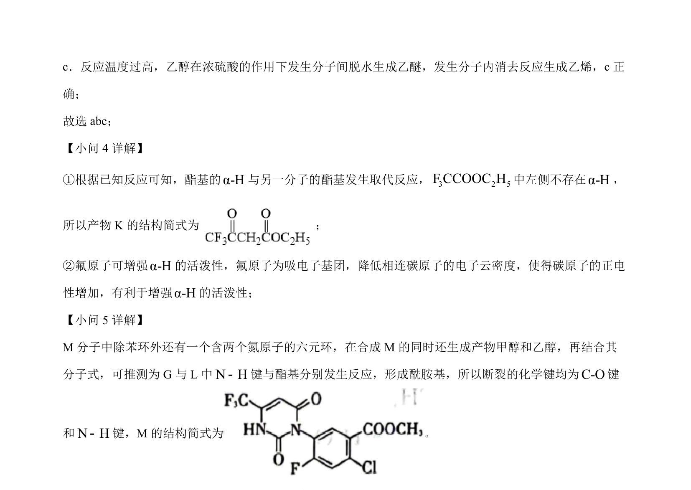

## 题面

## 摘要

有机合成路线推断，涉及官能团、酯化反应、平衡移动、反应机理等。

## 关联考点

- [[709-有机合成推断|有机合成推断]]
- [[448-官能团|官能团]]
- [[250-酯化反应|酯化反应]]
- [[644-反应机理|反应机理]]
- [[349-平衡移动|平衡移动]]

## 答案与解析

> 📄 原 PDF 第 14 页：`素材/真题/北京/2008-2024·（北京）化学高考真题/2024年高考化学试卷（北京）（解析卷）.pdf`
