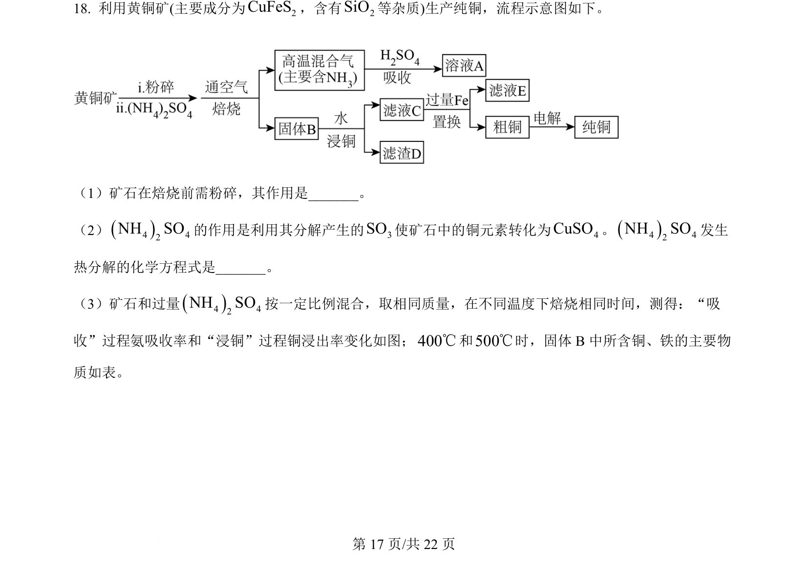
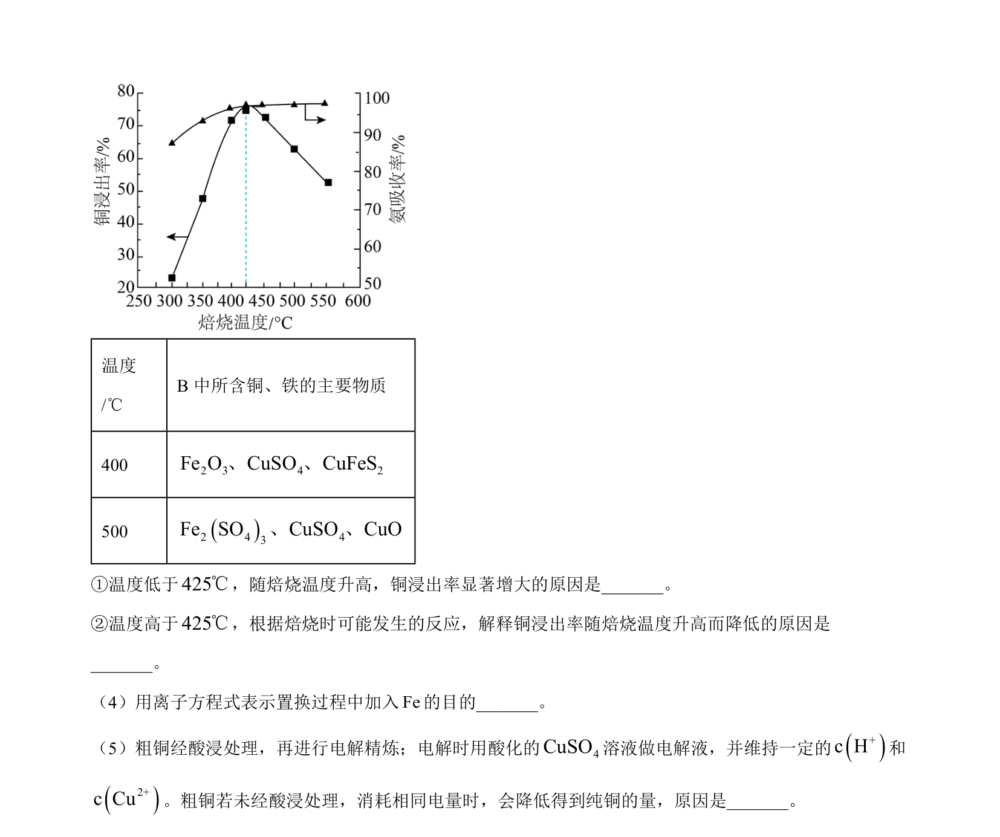
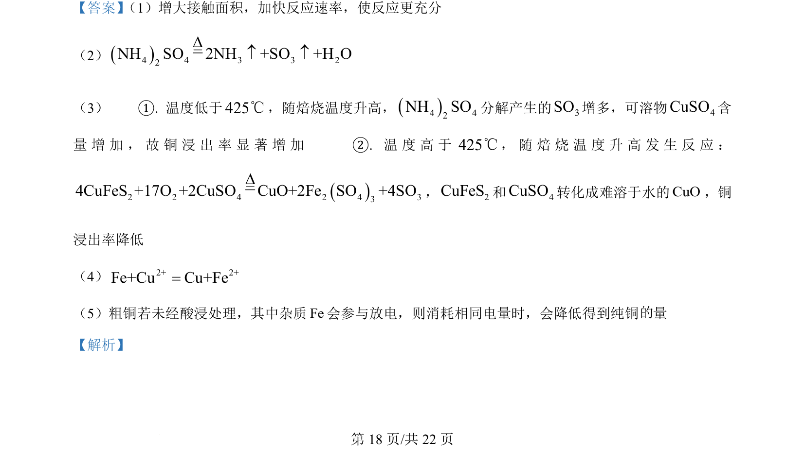
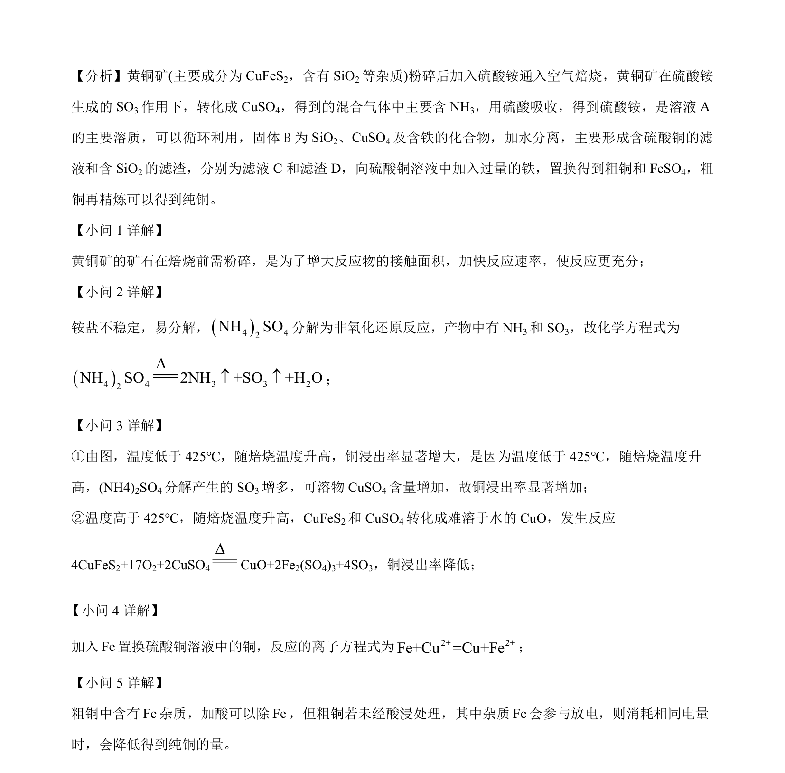

## 题面

## 摘要

黄铜矿焙烧、硫酸铵循环、物质分离与置换的工艺流程分析，涉及反应原理及操作目的。

## 关联考点

- [[680-工艺流程分析|工艺流程分析]]
- [[534-反应速率影响因素|反应速率影响因素]]
- [[铵盐分解反应方程式]]
- [[775-物质性质与处理|物质分离与提纯]]

## 答案与解析

> 📄 原 PDF 第 17 页：`素材/真题/北京/2008-2024·（北京）化学高考真题/2024年高考化学试卷（北京）（解析卷）.pdf`
