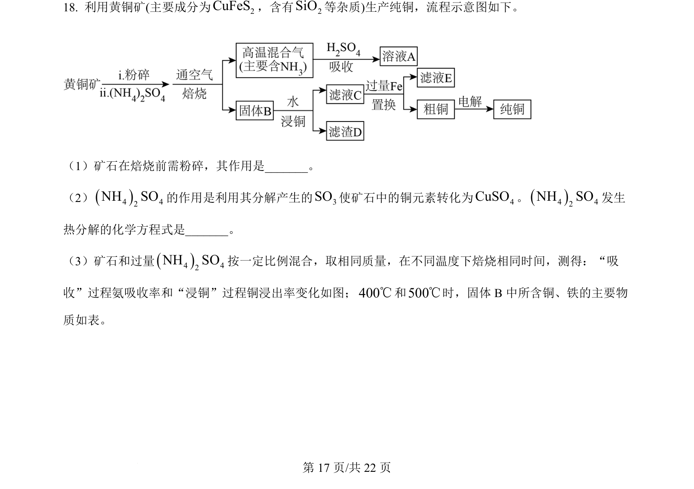
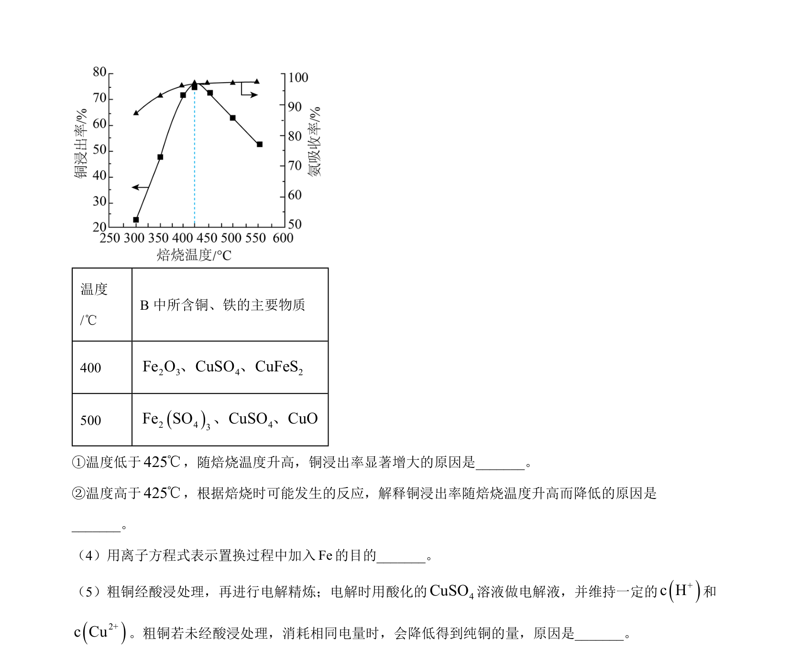
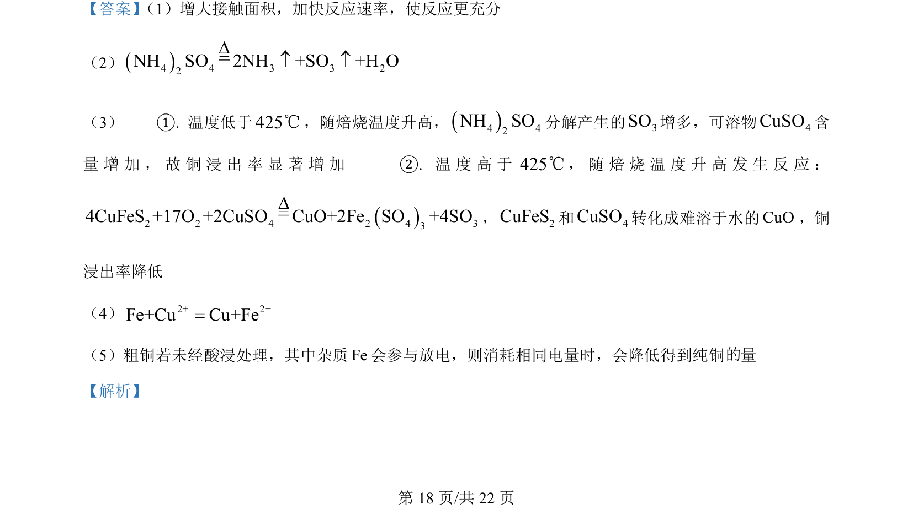
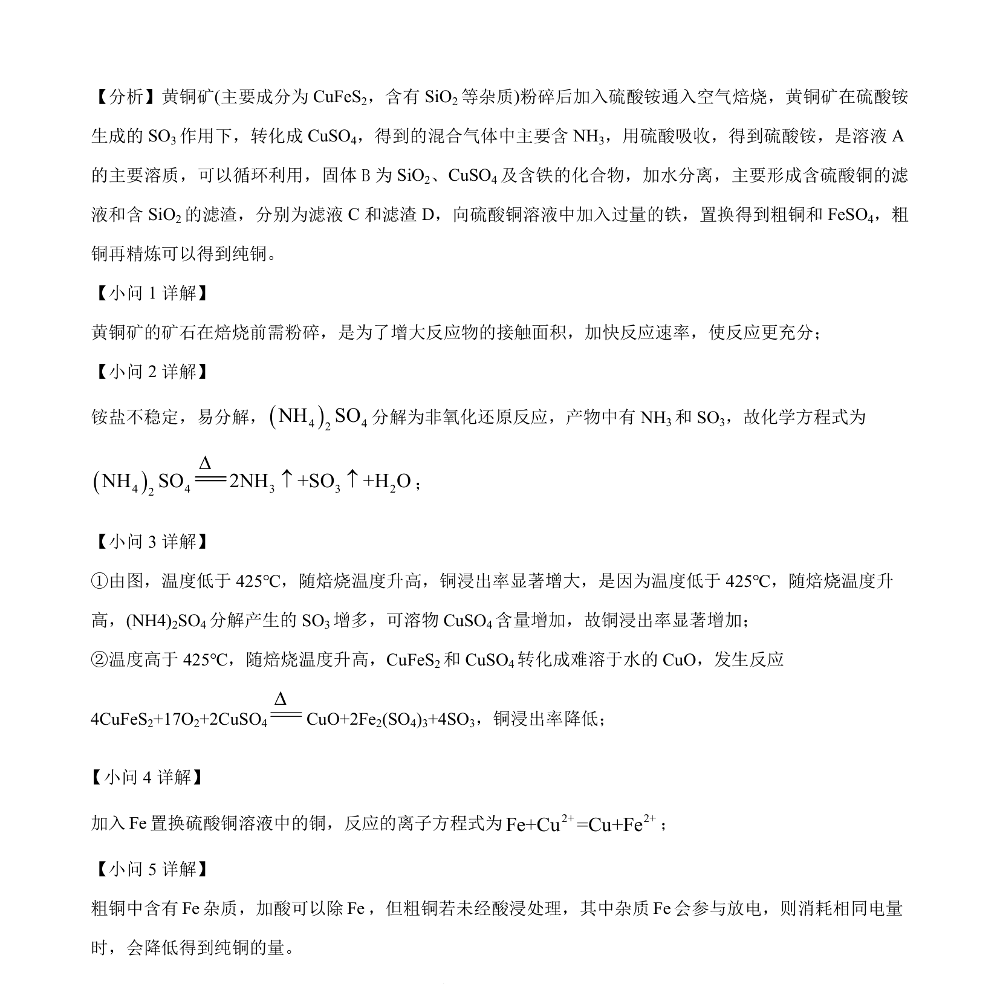

## 题面

## 摘要

黄铜矿焙烧、硫酸铵循环、物质分离与置换的工艺流程分析，涉及反应原理及操作目的。

## 关联考点

- [[680-工艺流程分析|工艺流程分析]]
- [[534-反应速率影响因素|反应速率影响因素]]
- [[铵盐分解反应方程式]]
- [[775-物质性质与处理|物质分离与提纯]]

## 答案与解析

> 📄 原 PDF 第 17 页：`素材/真题/北京/2008-2024·（北京）化学高考真题/2024年高考化学试卷（北京）（解析卷）.pdf`

<!-- 题干文本-start -->
## 题干文本
18. 利用黄铜矿(主要成分为 2CuFeS，含有2SiO等杂质)生产纯铜，流程示意图如下。
（1）矿石在焙烧前需粉碎，其作用是_______。
（2）4 42NH SO的作用是利用其分解产生的3SO使矿石中的铜元素转化为 4CuSO。4 42NH SO发生
热分解的化学方程式是_______。
（3）矿石和过量4 42NH SO按一定比例混合，取相同质量，在不同温度下焙烧相同时间，测得：“吸
收”过程氨吸收率和“浸铜”过程铜浸出率变化如图；400℃和500℃时，固体 B中所含铜、铁的主要物
质如表。
<!-- 题干文本-end -->

<!-- 解析文本-start -->
## 解析文本

<!-- 解析文本-end -->
