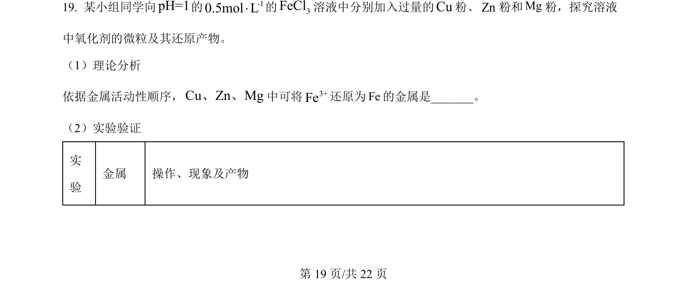
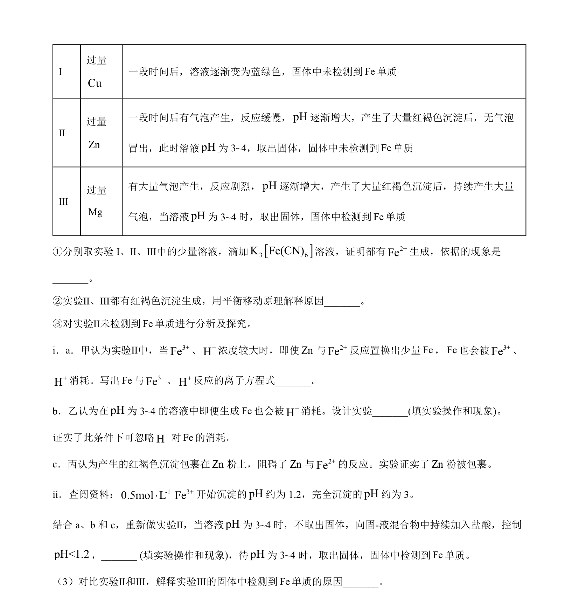
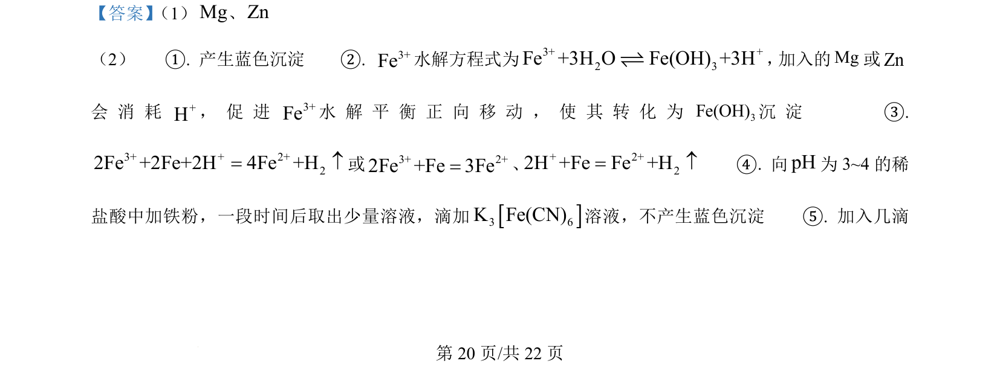
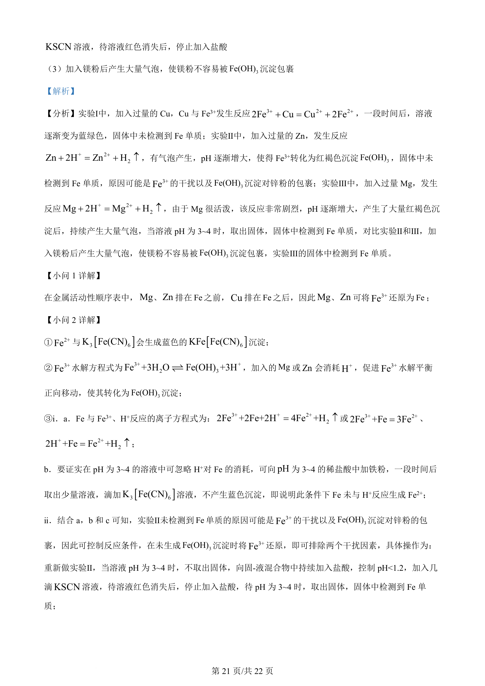
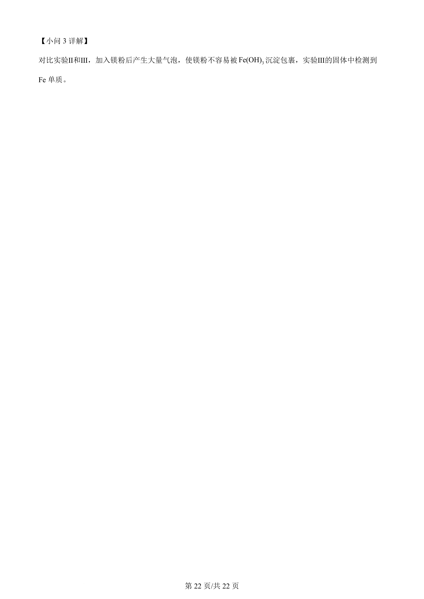

## 题面

## 摘要

通过对比实验探究Mg、Zn、Cu还原Fe³⁺的差异及pH、沉淀包裹对反应的影响

## 关联考点

- [[101-金属活动性顺序|金属活动性顺序]]
- [[铁离子氧化性]]
- [[326-水解平衡|水解平衡]]
- [[沉淀包裹]]

## 答案与解析

> 📄 原 PDF 第 19 页：`素材/真题/北京/2008-2024·（北京）化学高考真题/2024年高考化学试卷（北京）（解析卷）.pdf`
