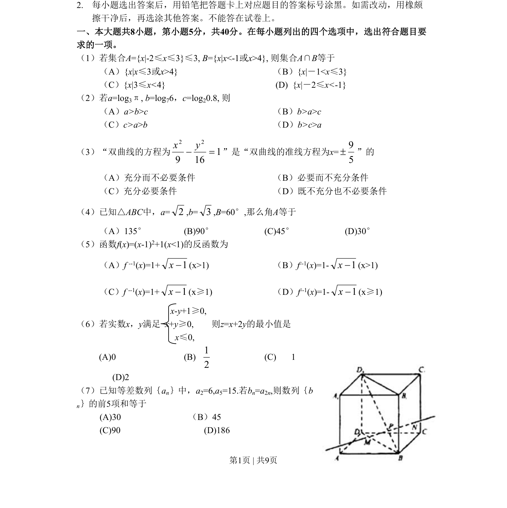
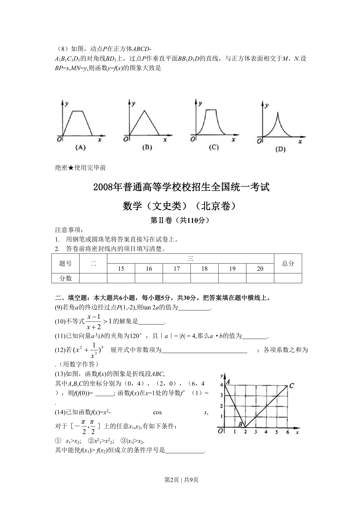
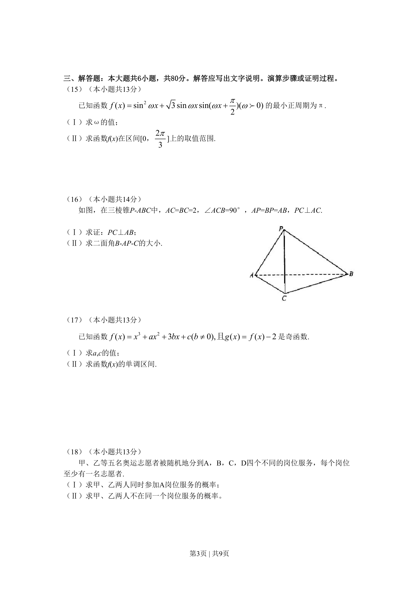
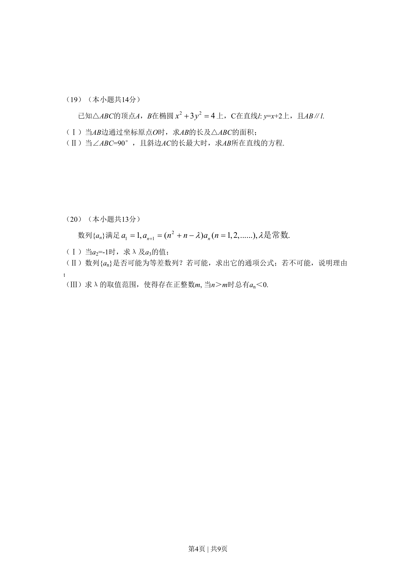
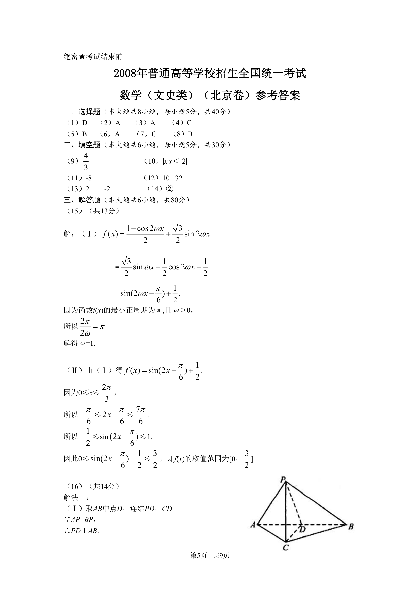
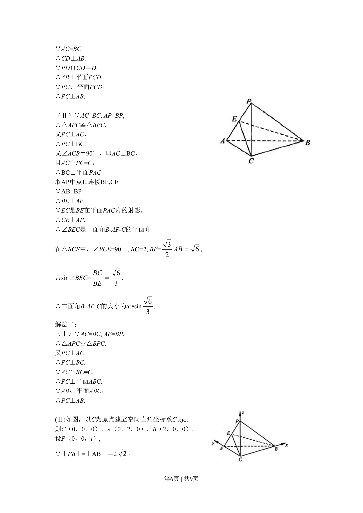
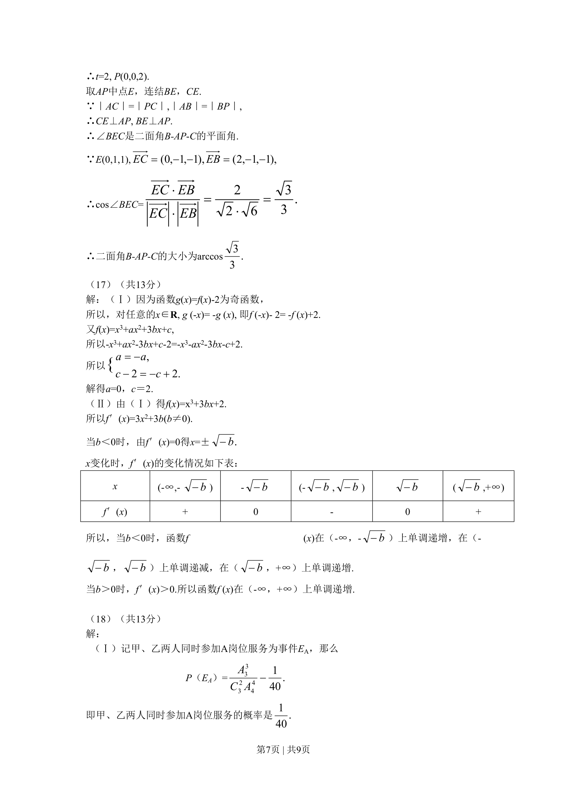
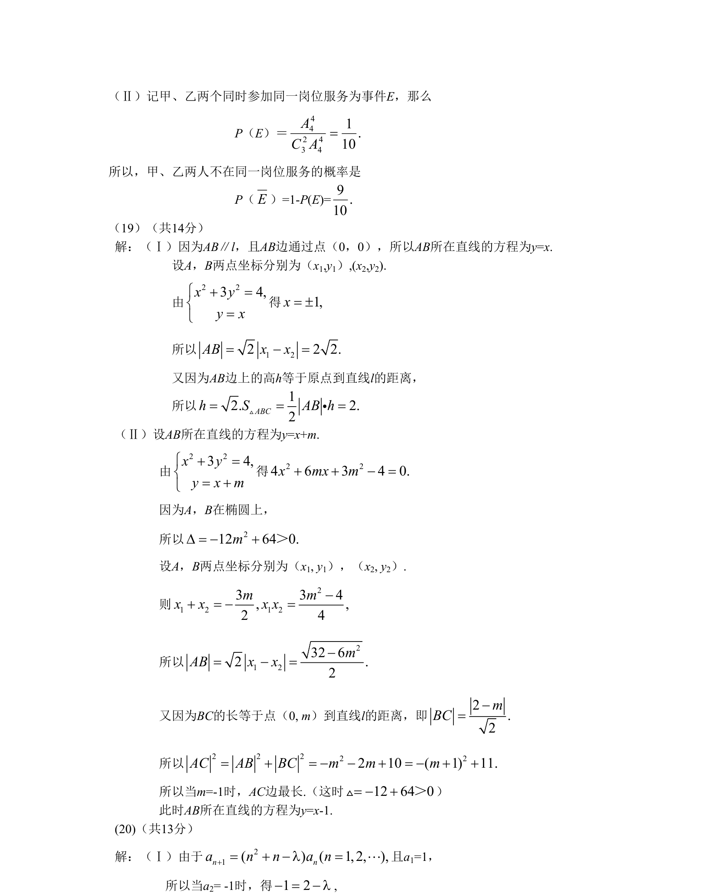

## 题面

## 摘要

（待补）

## 关联考点

## 答案与解析

> 📄 原 PDF 第 1 页：`素材/真题/北京/2008-2024·（北京）数学高考真题/2008年高考数学试卷（文）（北京）（解析卷）.pdf`

<!-- 题干文本-start -->
## 题干文本
2.每小题选出答案后，用铅笔把答题卡上对应题目的答案标号涂黑。如需改动，用橡颇
擦干净后，再选涂其他答案。不能答在试卷上。
一、本大题共8小题，第小题5分，共40分。在每小题列出的四个选项中，选出符合题目要
求的一项。
（1）若集合A={x|-2≤x≤3}≤3, B={x|x<-1或x>4}, 则集合A∩B等于
（A）{x|x≤3或x>4}（B）{x|－1<x≤3}
（C）{x|3≤x<4}  (D)  {x|－2≤x<-1}
（2）若a=log3π, b=log76，c=log20.8, 则
（A）a>b>c（B）b>a>c
（C）c>a>b（D）b>c>a
（3）“双曲线的方程为 116922=−yx”是“双曲线的准线方程为x=
59±”的
（A）充分而不必要条件 （B）必要而不充分条件
（C）充分必要条件 （D）既不充分也不必要条件
（4）已知△ABC中，a=2,b=3,B=60°,那么角A等于
（A）135°　　(B)90°　(C)45°(D)30°
（5）函数f(x)=(x-1)2+1(x<1)的反函数为
（A）f --1(x)=1+1−x(x>1)（B）f --1(x)=1-1−x(x>1)
（C）f --1(x)=1+1−x(x≥1)（D）f --1(x)=1-1−x(x≥1)
  x-y+1≥0,
（6）若实数x，y满足  x+y≥0,　　则z=x+2y的最小值是
x≤0,
(A)0 (B)
21　(C) 1
(D)2
（7）已知等差数列｛an｝中，a2=6,a5=15.若bn=a2n,则数列｛b
n｝的前5项和等于
(A)30                   （B）45
(C)90              　(D)186
<!-- 题干文本-end -->

<!-- 解析文本-start -->
## 解析文本

<!-- 解析文本-end -->
