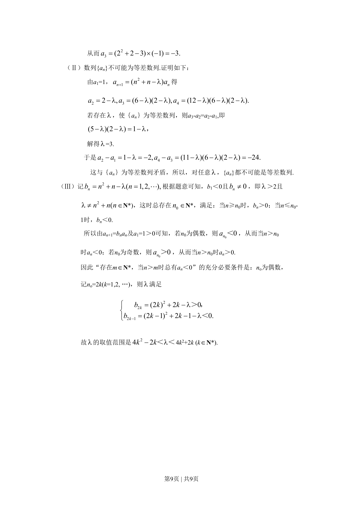

## 题面

## 摘要

（待补）

## 关联考点

## 答案与解析

> 📄 原 PDF 第 8 页：`素材/真题/北京/2008-2024·（北京）数学高考真题/2008年高考数学试卷（文）（北京）（解析卷）.pdf`

<!-- 题干文本-start -->
## 题干文本

<!-- 题干文本-end -->

<!-- 解析文本-start -->
## 解析文本
第8页 | 共9页  
（Ⅱ）记甲、乙两个同时参加同一岗位服务为事件E，那么
P（E）＝ .101442344=ACA
所以，甲、乙两人不在同一岗位服务的概率是
P（E）=1-P(E)=.109
（19）（共14分）
解：（Ⅰ）因为AB∥l，且AB边通过点（0，0），所以AB所在直线的方程为y=x.
设A，B两点坐标分别为（x1,y1）,(x2,y2).
由
2 23 4,x yy xì+ =í=î
得1,x= ±
所以 1 22 2 2.AB x x= − =
又因为AB边上的高h等于原点到直线l的距离，
所以 12. 2.2ABCh S AB h= = =Vg
（Ⅱ）设AB所在直线的方程为y=x+m.
 由
2 23 4,x yy x mì+ =í= +î
得2 24 6 3 4 0.x mx m+ + − =
因为A，B在椭圆上，
所以 212 64 0.mD = − +＞
　　　 设A，B两点坐标分别为（x1, y1），（x2, y2）.
则
21 2 1 23 3 4, ,2 4m mx x x x−+ = − =
　　　 所以
21 232 62 .2mAB x x−= − =
　　　 又因为BC的长等于点（0, m）到直线l的距离，即
2.2mBC−=
所以2 2 22 22 10 ( 1) 11.AC AB BC m m m= + = − − + = − + +
　　　 所以当m=-1时，AC边最长.（这时12 64 0= − +V＞）
此时AB所在直线的方程为y=x-1.
(20)（共13分）
解：（Ⅰ）由于 21( ) ( 1, 2, ),n na n n a n+= + − l = 且a1=1，
  所以当a2= -1时，得1 2− = − l,
  故3.l =
<!-- 解析文本-end -->
