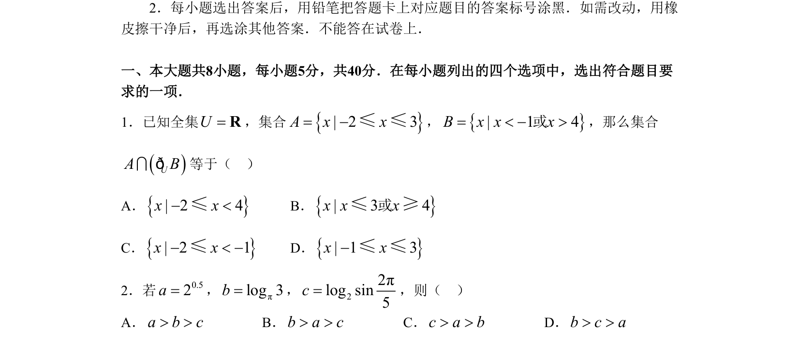

## 题面

## 摘要

考查集合的基本运算，涉及补集、交集及不等式表示的数集。

## 关联考点

- [[集合的补集]]
- [[1139-集合的交集|集合的交集]]
- [[267-一元二次不等式|一元二次不等式]]
- [[数轴表示法]]

## 答案与解析

> 📄 原 PDF 第 1 页：`素材/真题/北京/2008-2024·（北京）数学高考真题/2008年高考数学试卷（理）（北京）（解析卷）.pdf`
