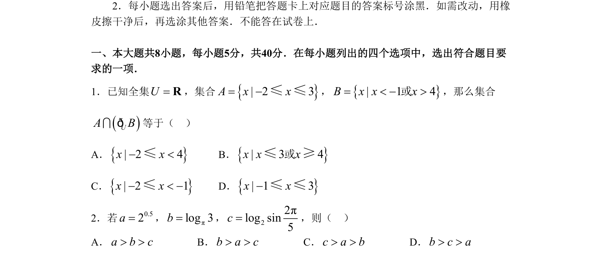

## 题面

## 摘要

考查集合的基本运算，涉及补集、交集及不等式表示的数集。

## 关联考点

- [[集合的补集]]
- [[1139-集合的交集|集合的交集]]
- [[267-一元二次不等式|一元二次不等式]]
- [[数轴表示法]]

## 答案与解析

> 📄 原 PDF 第 1 页：`素材/真题/北京/2008-2024·（北京）数学高考真题/2008年高考数学试卷（理）（北京）（解析卷）.pdf`

<!-- 题干文本-start -->
## 题干文本
2．每小题选出答案后，用铅笔把答题卡上对应题目的答案标号涂黑．如需改动，用橡
皮擦干净后，再选涂其他答案．不能答在试卷上．
一、本大题共8小题，每小题5分，共40分．在每小题列出的四个选项中，选出符合题目要
求的一项．
1．已知全集U=R，集合{}| 2 3A x x= -≤≤，{}| 1 4B x x x= < - >或，那么集合
()UA BIð等于（    ）
A．{}| 2 4x x- <≤B．{}| 3 4x x x或≤≥
C．{}| 2 1x x- < -≤D．{}| 1 3x x-≤≤
2．若0.52a=， πlog 3b=， 22πlog sin5c=，则（    ）
A．a b c> >B．b a c> >C．c a b> >D．b c a> >
<!-- 题干文本-end -->

<!-- 解析文本-start -->
## 解析文本

<!-- 解析文本-end -->
