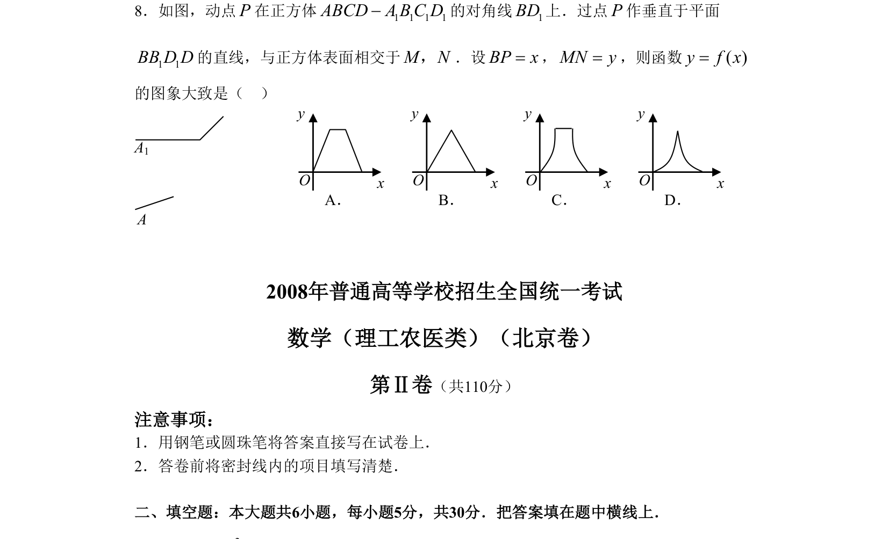

## 题面

## 摘要

在正方体中，动点P在对角线BD1上移动，过P作垂直于平面BB1D1D的直线得线段MN，考查y=MN随x=BP变化的函数图象。

## 关联考点

- [[1045-空间几何|空间几何]]
- [[715-动点轨迹|动点轨迹]]
- [[187-函数图象|函数图象]]

## 答案与解析

> 📄 原 PDF 第 2 页：`素材/真题/北京/2008-2024·（北京）数学高考真题/2008年高考数学试卷（理）（北京）（解析卷）.pdf`
