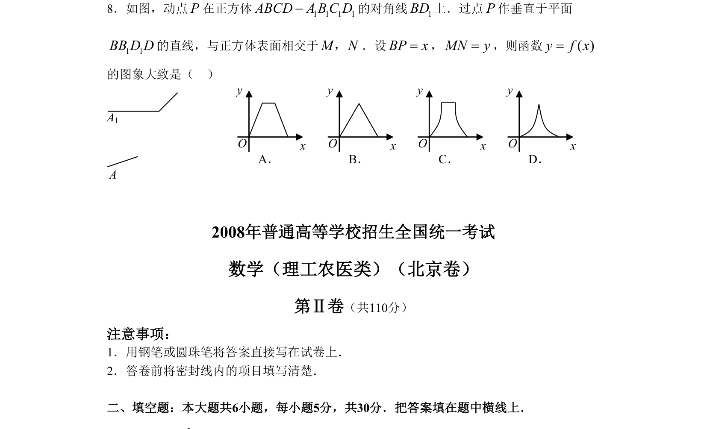

## 题面

## 摘要

在正方体中，动点P在对角线BD1上移动，过P作垂直于平面BB1D1D的直线得线段MN，考查y=MN随x=BP变化的函数图象。

## 关联考点

- [[1044-空间几何|空间几何]]
- [[715-动点轨迹|动点轨迹]]
- [[187-函数图象|函数图象]]

## 答案与解析

> 📄 原 PDF 第 2 页：`素材/真题/北京/2008-2024·（北京）数学高考真题/2008年高考数学试卷（理）（北京）（解析卷）.pdf`

<!-- 题干文本-start -->
## 题干文本
8．如图，动点P在正方体 1 1 1 1ABCD A B C D-的对角线1BD上．过点P作垂直于平面
1 1BB D D的直线，与正方体表面相交于M N，．设BP x=，MN y=，则函数( )y f x=
的图象大致是（    ）
2008年普通高等学校招生全国统一考试
数学（理工农医类）（北京卷）
第Ⅱ卷（共110分）
注意事项：
1．用钢笔或圆珠笔将答案直接写在试卷上．
2．答卷前将密封线内的项目填写清楚．
二、填空题：本大题共6小题，每小题5分，共30分．把答案填在题中横线上．
<!-- 题干文本-end -->

<!-- 解析文本-start -->
## 解析文本

<!-- 解析文本-end -->
