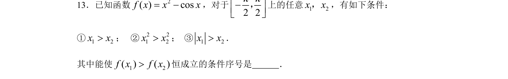

## 题面

## 摘要

判断所给条件能否使函数值大小关系恒成立，需结合函数单调性与奇偶性分析。

## 关联考点

- [[432-导数与函数单调性|函数单调性]]
- [[817-奇偶性|奇偶性]]
- [[1292-导数的应用|导数应用]]

## 答案与解析

> 📄 原 PDF 第 3 页：`素材/真题/北京/2008-2024·（北京）数学高考真题/2008年高考数学试卷（理）（北京）（解析卷）.pdf`
