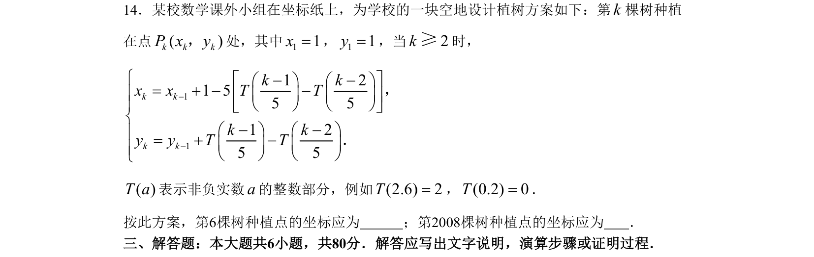

## 题面

## 摘要

根据递推关系与取整函数求特定项坐标，需分析数列周期性。

## 关联考点

- [[数列递推]]
- [[1164-取整函数|取整函数]]
- [[456-数列周期性|周期数列]]
- [[134-推理|归纳推理]]

## 答案与解析

> 📄 原 PDF 第 3 页：`素材/真题/北京/2008-2024·（北京）数学高考真题/2008年高考数学试卷（理）（北京）（解析卷）.pdf`
