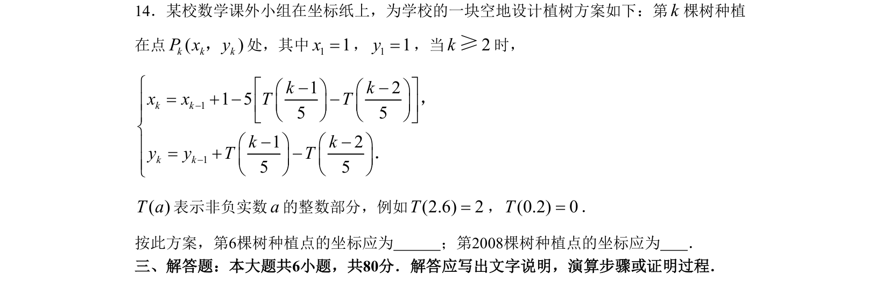

## 题面

## 摘要

根据递推关系与取整函数求特定项坐标，需分析数列周期性。

## 关联考点

- [[1382-数列递推|数列递推]]
- [[1163-取整函数|取整函数]]
- [[456-数列周期性|周期数列]]
- [[037-推理|归纳推理]]

## 答案与解析

> 📄 原 PDF 第 3 页：`素材/真题/北京/2008-2024·（北京）数学高考真题/2008年高考数学试卷（理）（北京）（解析卷）.pdf`

<!-- 题干文本-start -->
## 题干文本
14．某校数学课外小组在坐标纸上，为学校的一块空地设计植树方案如下：第k棵树种植
在点( )k k kP x y，处，其中11x=，11y=，当2k≥时，
111 21 55 51 25 5k kk kk kx x T Tk ky y T T--ìé - - ùæ ö æ ö= + - -ïç ÷ ç ÷ê úï è ø è øë ûí- -æ ö æ öï= + -ç ÷ ç ÷ïè ø è øî，．( )T a表示非负实数a的整数部分，例如(2.6) 2T=，(0.2) 0T=．
按此方案，第6棵树种植点的坐标应为            ；第2008棵树种植点的坐标应为       ．
三、解答题：本大题共6小题，共80分．解答应写出文字说明，演算步骤或证明过程．
<!-- 题干文本-end -->

<!-- 解析文本-start -->
## 解析文本

<!-- 解析文本-end -->
