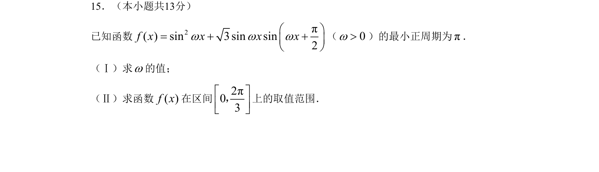

## 题面

## 摘要

函数 f(x) = sin²ωx + √3 sinωx sin(ωx + π/2) 化简后利用最小正周期求 ω，并求闭区间上的值域。

## 关联考点

- [[272-三角恒等变换|三角恒等变换]]
- [[正弦型函数的周期]]
- [[正弦函数的值域]]

## 答案与解析

> 📄 原 PDF 第 3 页：`素材/真题/北京/2008-2024·（北京）数学高考真题/2008年高考数学试卷（理）（北京）（解析卷）.pdf`
