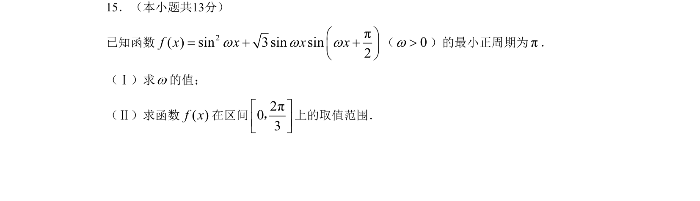

## 题面

## 摘要

函数 f(x) = sin²ωx + √3 sinωx sin(ωx + π/2) 化简后利用最小正周期求 ω，并求闭区间上的值域。

## 关联考点

- [[272-三角恒等变换|三角恒等变换]]
- [[正弦型函数的周期]]
- [[正弦函数的值域]]

## 答案与解析

> 📄 原 PDF 第 3 页：`素材/真题/北京/2008-2024·（北京）数学高考真题/2008年高考数学试卷（理）（北京）（解析卷）.pdf`

<!-- 题干文本-start -->
## 题干文本
15．（本小题共13分）
已知函数 2π( ) sin 3 sin sin2f x x x xw w wæ ö= + +ç ÷è ø
（0w>）的最小正周期为π．
（Ⅰ）求w的值；
（Ⅱ）求函数( )f x在区间2π03é ùê úë û，上的取值范围．
<!-- 题干文本-end -->

<!-- 解析文本-start -->
## 解析文本

<!-- 解析文本-end -->
