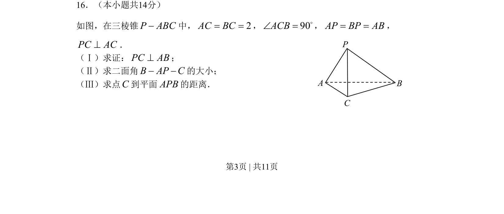

## 题面

## 摘要

考查三棱锥中的垂直证明、二面角计算及点到平面距离求解。

## 关联考点

- [[1083-线线垂直|线线垂直]]
- [[353-空间角|二面角]]
- [[354-空间距离|点面距离]]
- [[401-空间向量基本概念|空间向量]]

## 答案与解析

> 📄 原 PDF 第 3 页：`素材/真题/北京/2008-2024·（北京）数学高考真题/2008年高考数学试卷（理）（北京）（解析卷）.pdf`
