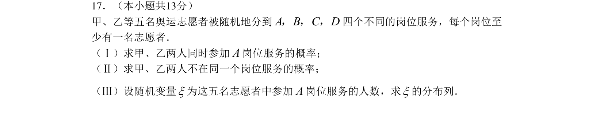

## 题面

## 摘要

考查等可能事件的概率计算、排列组合应用及随机变量的分布列。

## 关联考点

- [[1058-等可能事件概率|等可能事件概率]]
- [[031-搭配|排列组合]]
- [[随机变量分布列]]

## 答案与解析

> 📄 原 PDF 第 4 页：`素材/真题/北京/2008-2024·（北京）数学高考真题/2008年高考数学试卷（理）（北京）（解析卷）.pdf`
