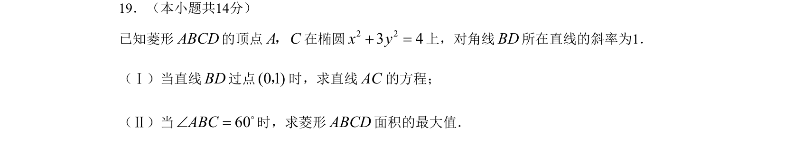

## 题面

## 摘要

菱形与椭圆结合，考查直线方程、对称性质及面积最值求解。

## 关联考点

- [[389-椭圆定义与方程|椭圆]]
- [[1026-直线方程|直线方程]]
- [[1167-点差法|点差法]]
- [[286-函数的最值|最值]]

## 答案与解析

> 📄 原 PDF 第 4 页：`素材/真题/北京/2008-2024·（北京）数学高考真题/2008年高考数学试卷（理）（北京）（解析卷）.pdf`
