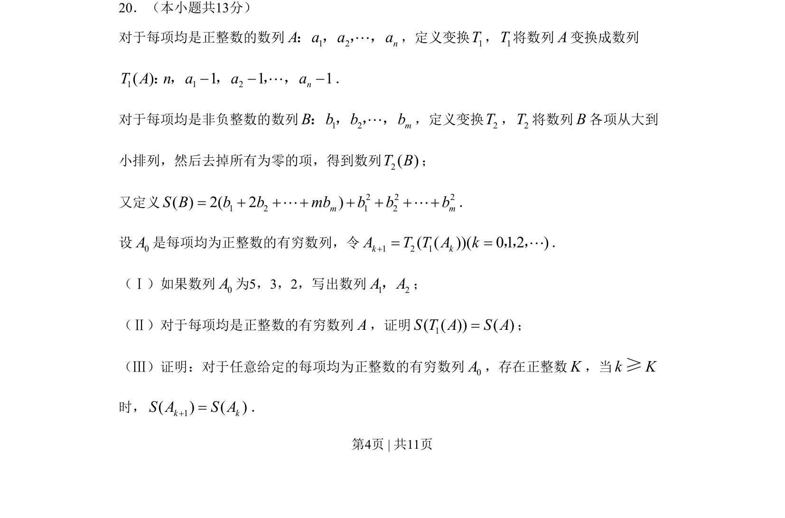
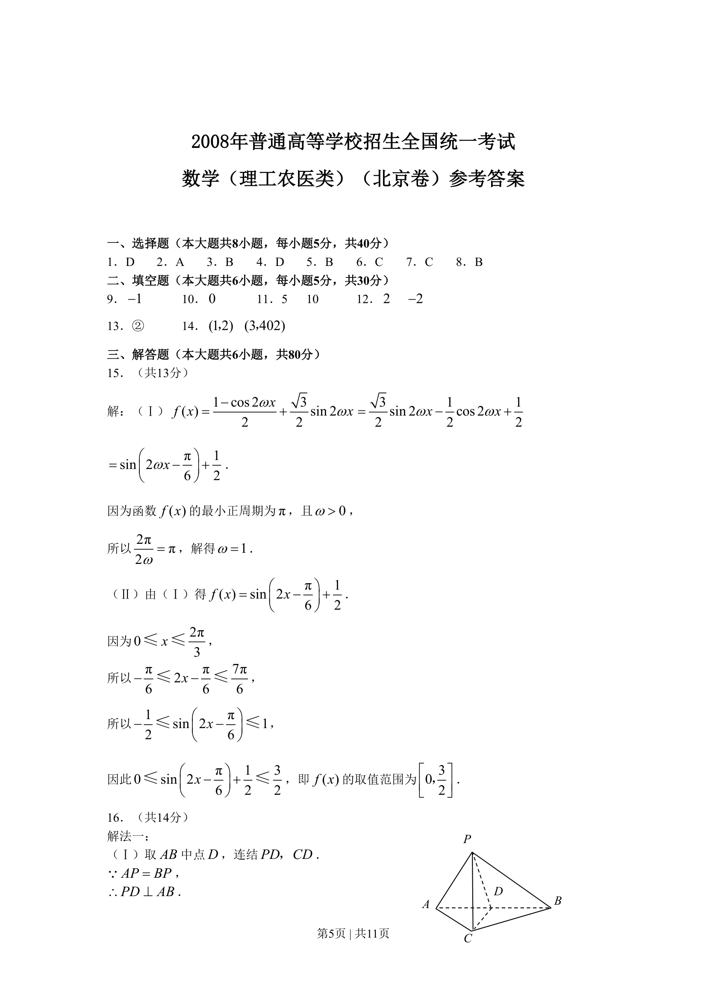
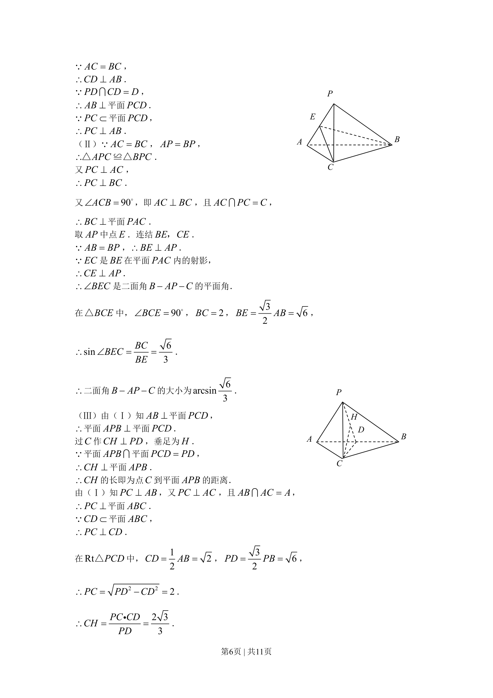
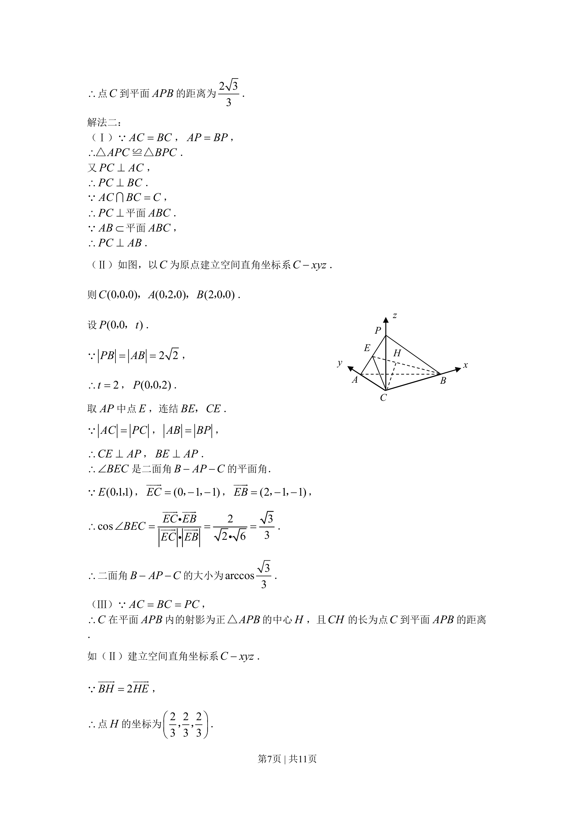
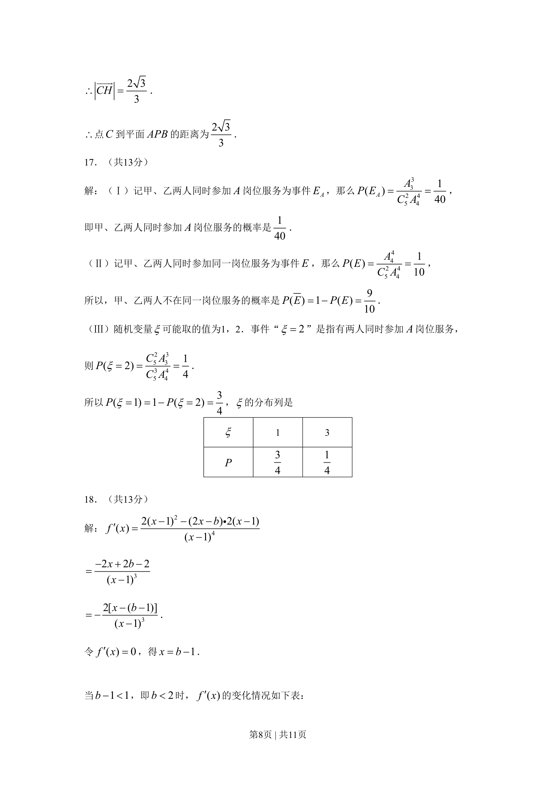
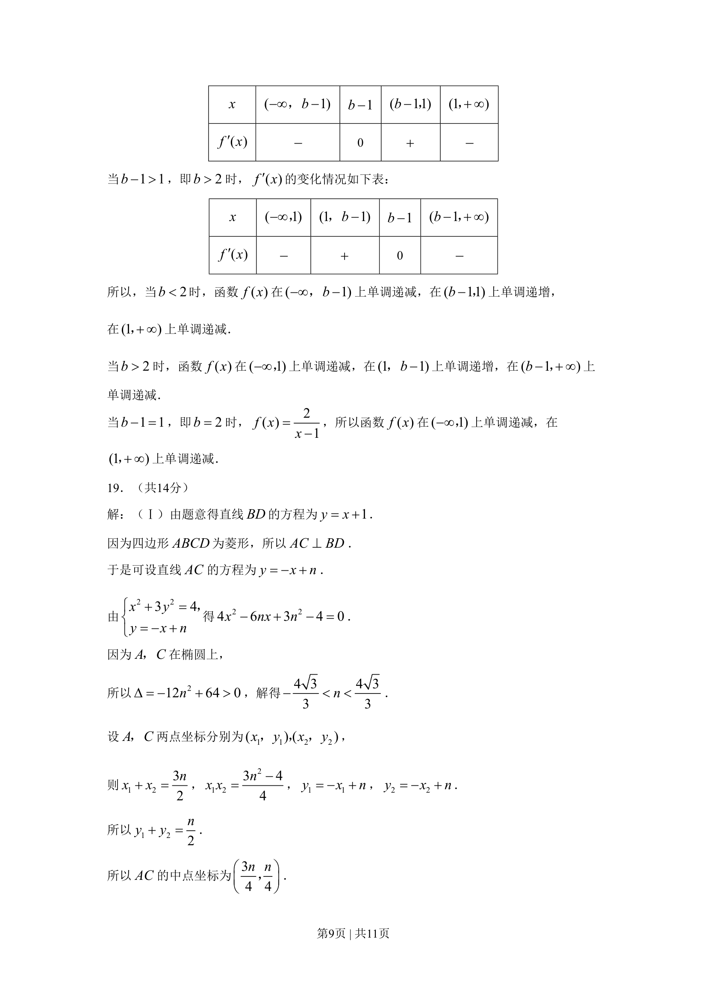
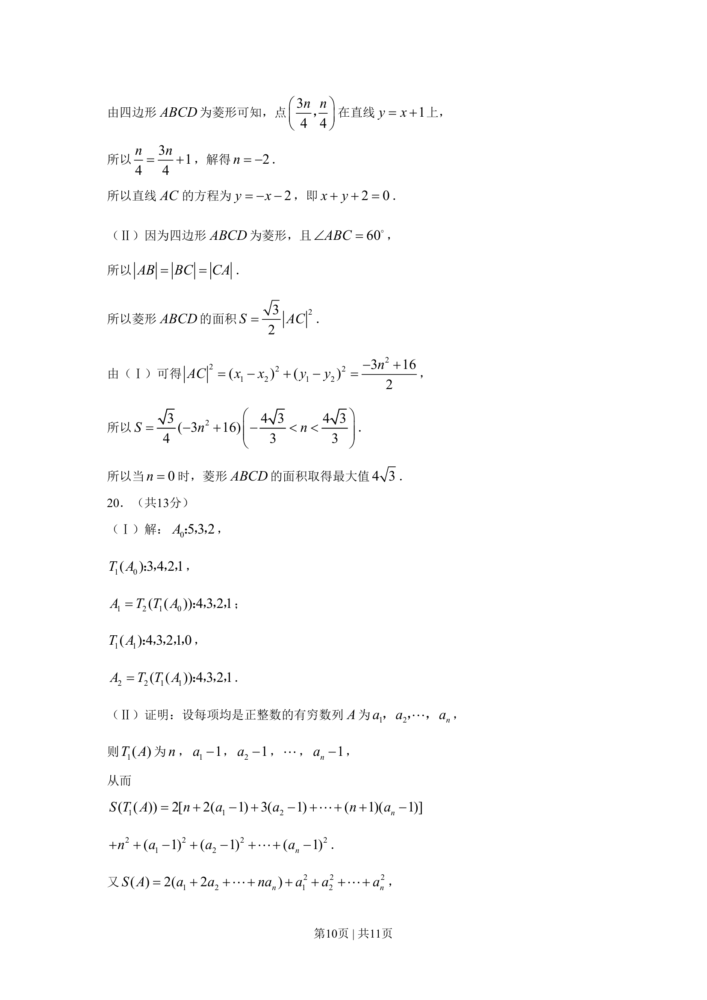
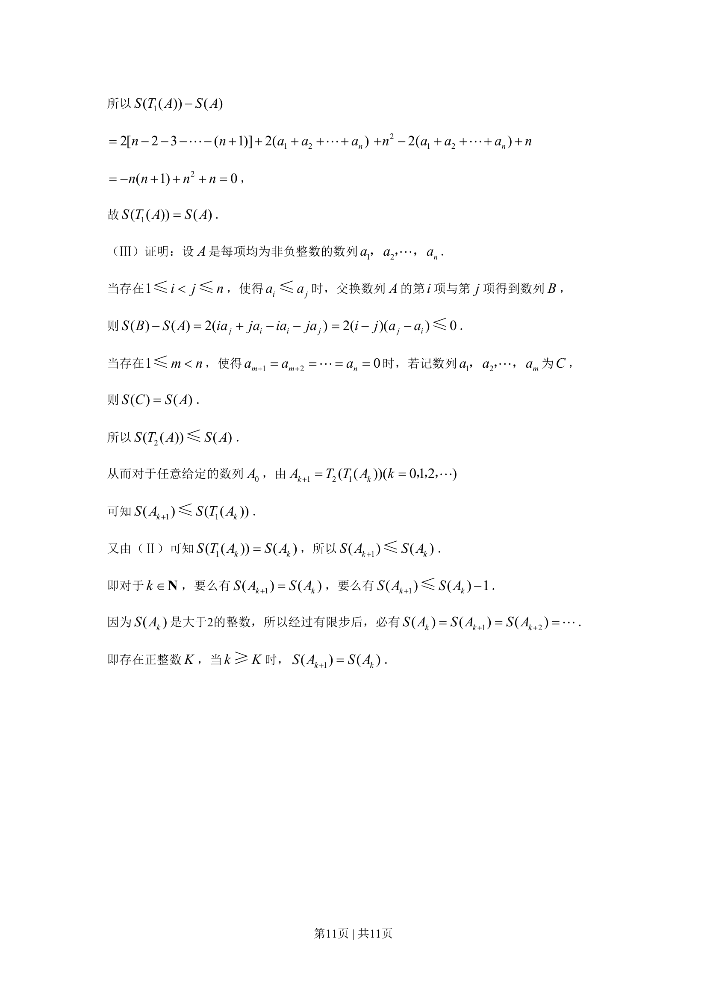

## 题面

## 摘要

考查数列新定义变换下递推关系与终周期性的证明。

## 关联考点

- [[381-数列概念-高中|数列]]
- [[递推变换]]
- [[1385-新定义|新定义]]
- [[386-数学归纳法-初步|数学归纳法]]

## 答案与解析

> 📄 原 PDF 第 4 页：`素材/真题/北京/2008-2024·（北京）数学高考真题/2008年高考数学试卷（理）（北京）（解析卷）.pdf`
