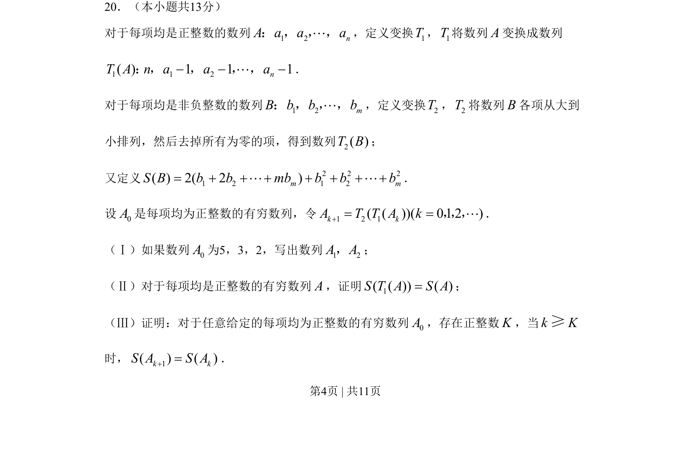
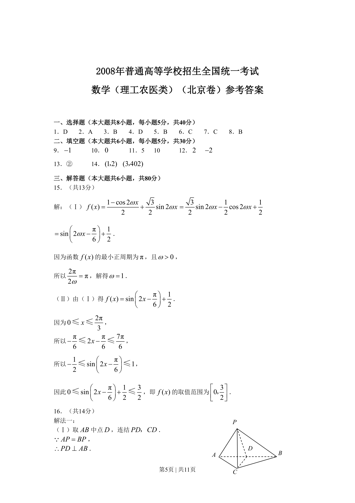
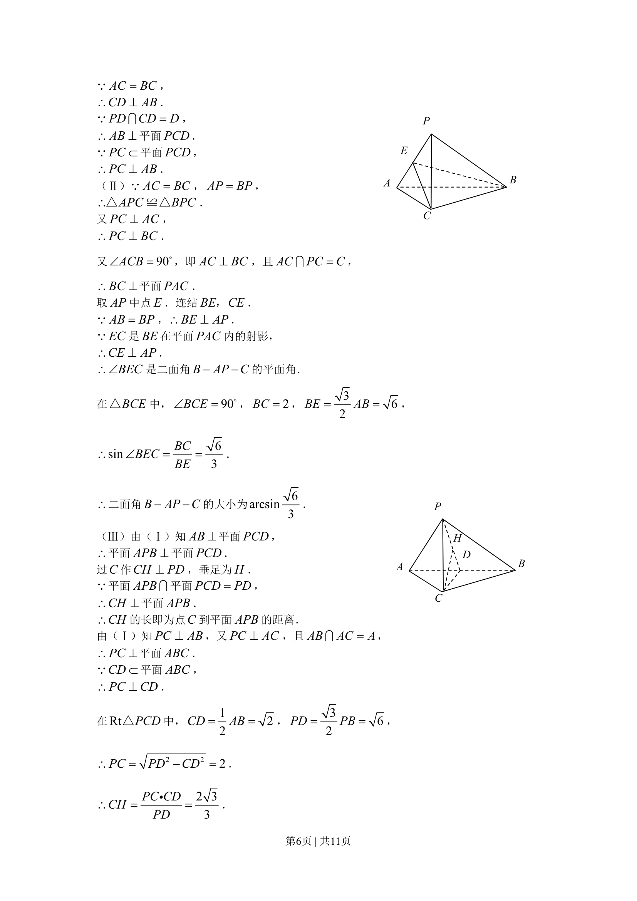
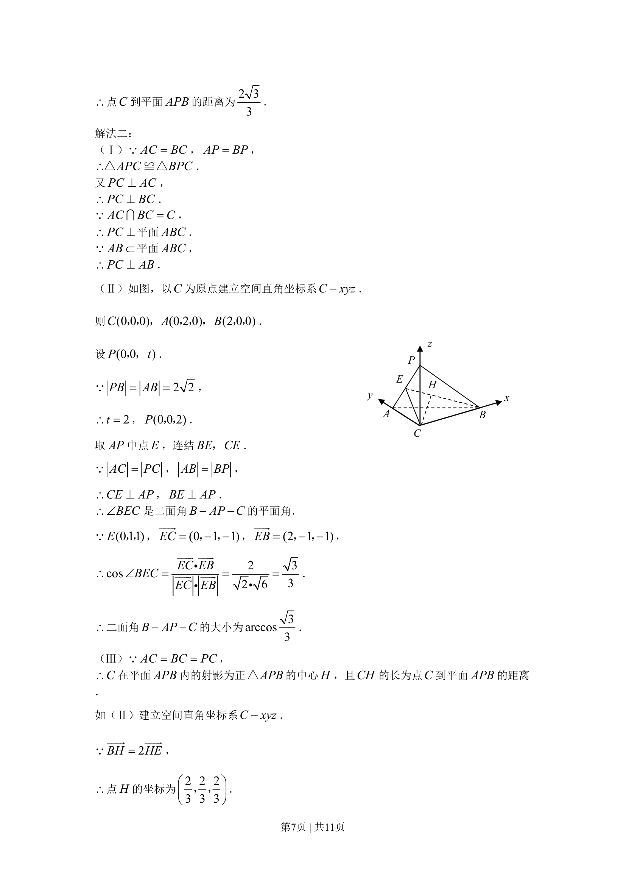
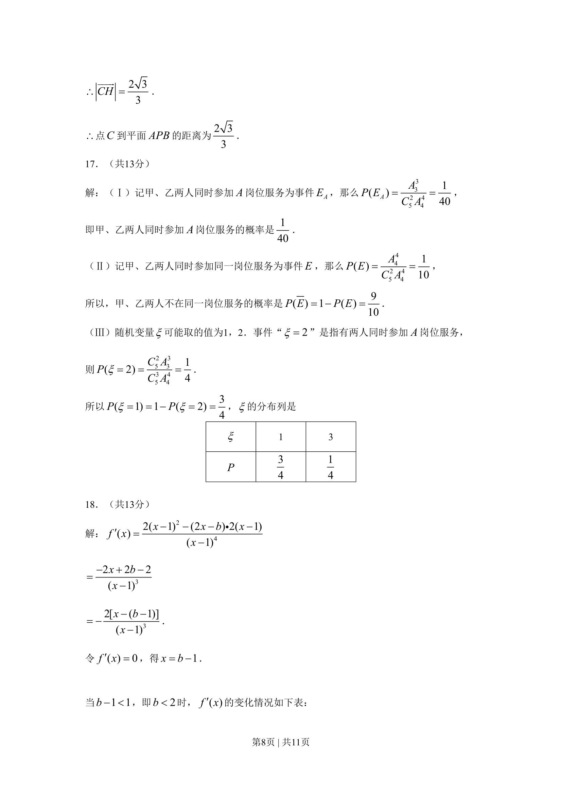
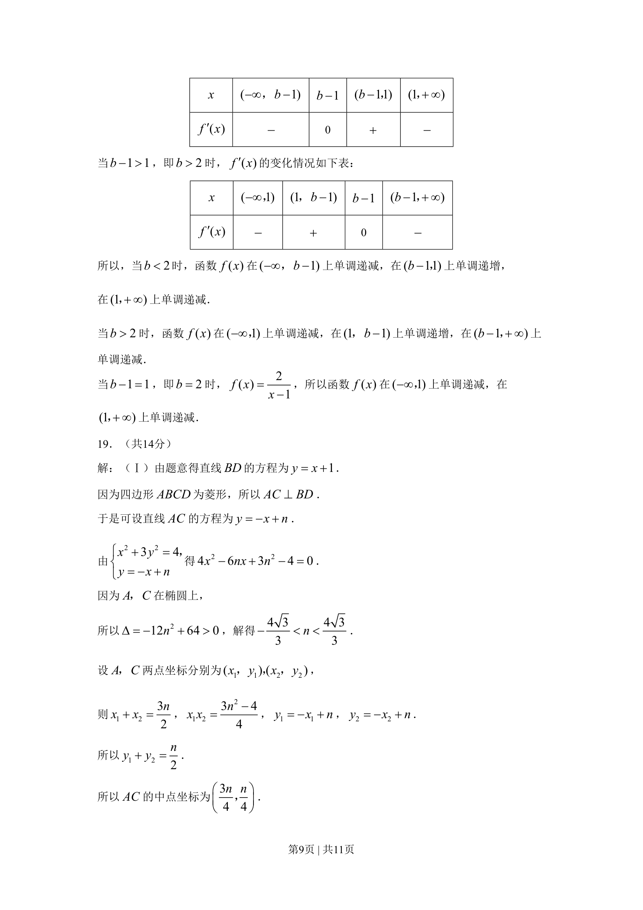
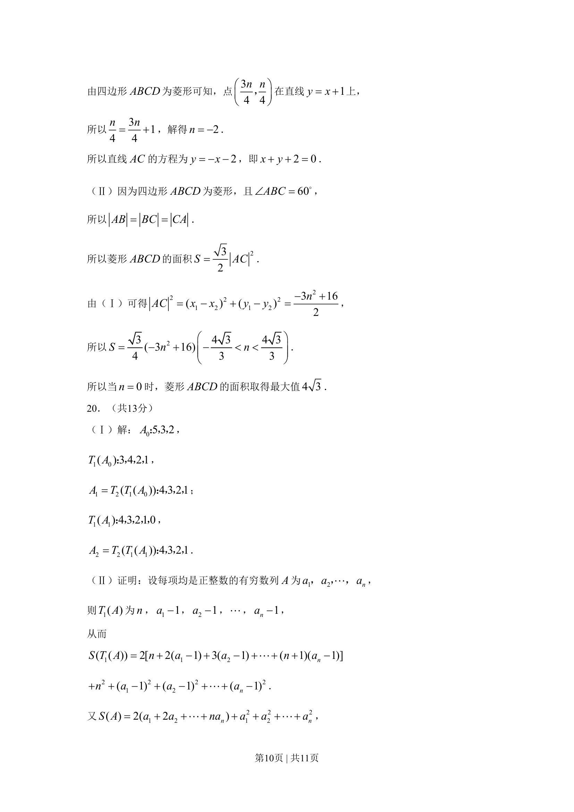
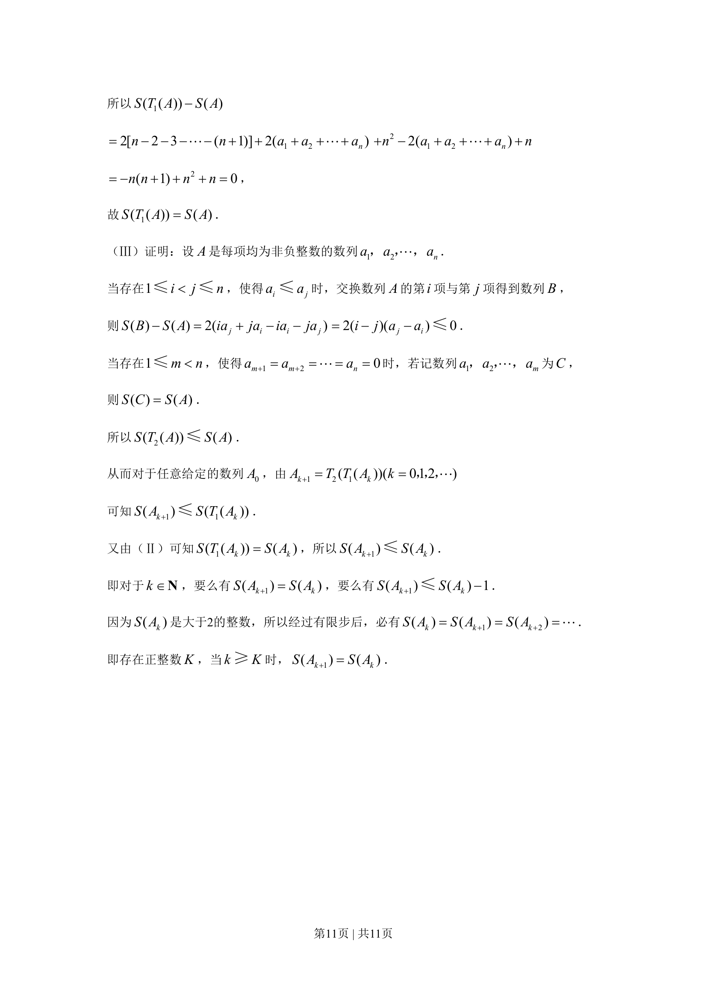

## 题面

## 摘要

考查数列新定义变换下递推关系与终周期性的证明。

## 关联考点

- [[381-数列概念-高中|数列]]
- [[递推变换]]
- [[1385-新定义|新定义]]
- [[386-数学归纳法-初步|数学归纳法]]

## 答案与解析

> 📄 原 PDF 第 4 页：`素材/真题/北京/2008-2024·（北京）数学高考真题/2008年高考数学试卷（理）（北京）（解析卷）.pdf`

<!-- 题干文本-start -->
## 题干文本
20．（本小题共13分）
对于每项均是正整数的数列1 2nA a a aL：，，，，定义变换1T，1T将数列A变换成数列
1( )T A：1 21 1 1nn a a a- - -L，，，，．
对于每项均是非负整数的数列1 2mB b b bL：，，，，定义变换2T，2T将数列B各项从大到
小排列，然后去掉所有为零的项，得到数列2( )T B；
又定义 2 2 21 2 1 2( ) 2( 2 )m mS B b b mb b b b= + + + + + + +L L．
设0A是每项均为正整数的有穷数列，令1 2 1( ( ))( 0 1 2 )k kA T T A k+= =L，，，．
（Ⅰ）如果数列0A为5，3，2，写出数列1 2A A，；
（Ⅱ）对于每项均是正整数的有穷数列A，证明1( ( )) ( )S T A S A=；
（Ⅲ）证明：对于任意给定的每项均为正整数的有穷数列0A，存在正整数K，当k K≥
时， 1( ) ( )k kS A S A+=．
<!-- 题干文本-end -->

<!-- 解析文本-start -->
## 解析文本

<!-- 解析文本-end -->
