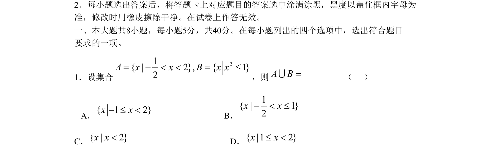
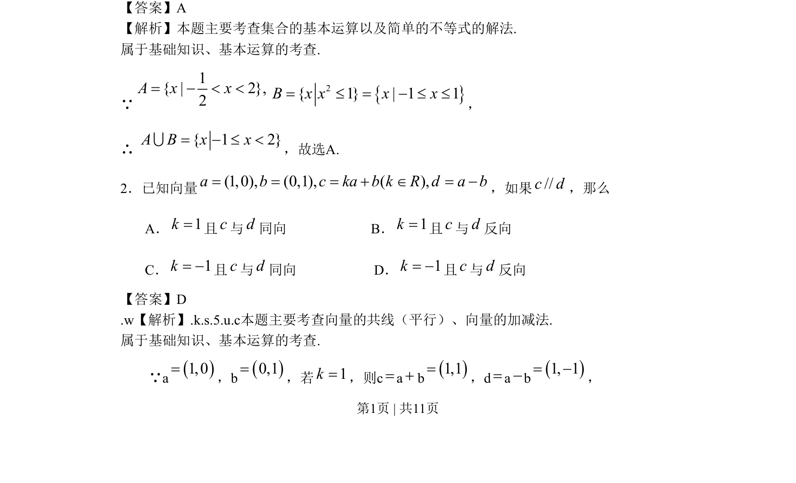
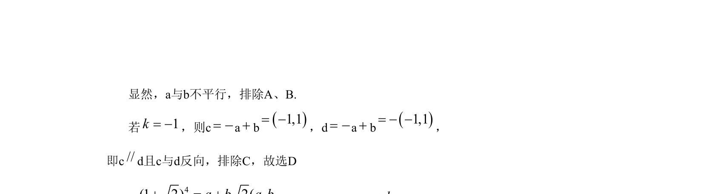

## 题面

## 摘要

考查向量共线（平行）与加减法运算，通过坐标运算判断向量关系

## 关联考点

- [[向量的共线（平行）]]
- [[744-向量加减法|向量的加减法]]

## 答案与解析

> 📄 原 PDF 第 1 页：`素材/真题/北京/2008-2024·（北京）数学高考真题/2009年高考数学试卷（文）（北京）（解析卷）.pdf`

<!-- 题干文本-start -->
## 题干文本
2．每小题选出答案后，将答题卡上对应题目的答案选中涂满涂黑，黑度以盖住框内字母为
准，修改时用橡皮擦除干净。在试卷上作答无效。
一、本大题共8小题，每小题5分，共40分。在每小题列出的四个选项中，选出符合题目
要求的一项。
1．设集合 ，则                   （     ）
   A．                                 B．
C．                           D．
<!-- 题干文本-end -->

<!-- 解析文本-start -->
## 解析文本
【答案】A
【解析】本题主要考查集合的基本运算以及简单的不等式的解法. 
属于基础知识、基本运算的考查.
∵ ，
∴ ，故选A.
2．已知向量 ，如果 ，那么
       A． 且 与 同向                        B． 且 与 反向
       C． 且 与 同向                      D． 且 与 反向
【答案】D
.w【解析】.k.s.5.u.c本题主要考查向量的共线（平行）、向量的加减法. 
属于基础知识、基本运算的考查.
        ∵a，b，若 ，则c a b，d a b，
21{ | 2}, { 1 }2A x x B x x= - < < = £A B=U{ 1 2}x x- £ <1{ | 1 }2x x- < £{ | 2}x x<{ |1 2}x x£ <1{ | 2},2A x x= - < <2{ 1 } | 1 1B x x x x= £ = - £ £{ 1 2}A B x x= - £ <U(1,0), (0,1), ( ),a b c ka b k R d a b= = = + Î = -//c d1k=cd1k=cd1k= -cd1k= -cd1,0=0,1=1k==+1,1==-1, 1= -
<!-- 解析文本-end -->
