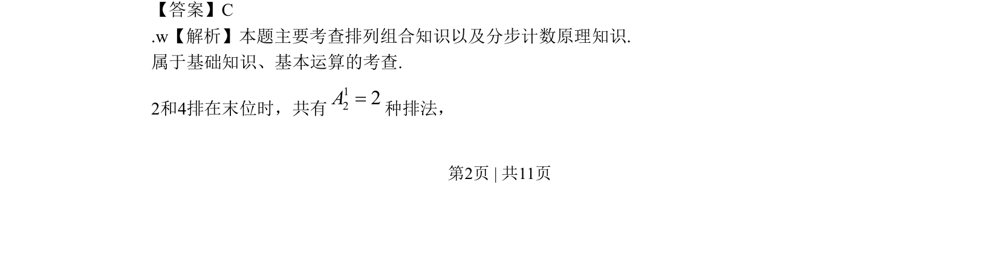
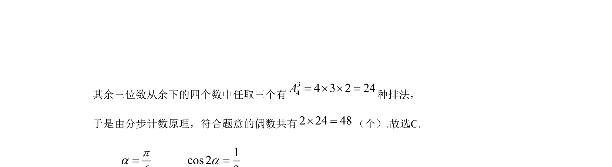

## 题面

## 摘要

本题考查排列组合及分步计数原理，通过特殊位置法求解偶数的排列个数。

## 关联考点

- [[031-搭配|排列组合]]
- [[477-分步计数原理|分步计数原理]]
- [[特殊元素优先法]]

## 答案与解析

> 📄 原 PDF 第 2 页：`素材/真题/北京/2008-2024·（北京）数学高考真题/2009年高考数学试卷（文）（北京）（解析卷）.pdf`
