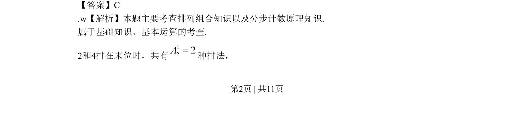
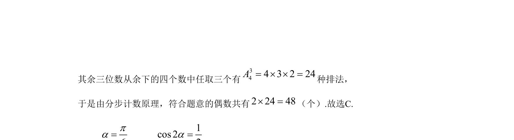

## 题面

## 摘要

本题考查排列组合及分步计数原理，通过特殊位置法求解偶数的排列个数。

## 关联考点

- [[031-搭配|排列组合]]
- [[477-分步计数原理|分步计数原理]]
- [[特殊元素优先法]]

## 答案与解析

> 📄 原 PDF 第 2 页：`素材/真题/北京/2008-2024·（北京）数学高考真题/2009年高考数学试卷（文）（北京）（解析卷）.pdf`

<!-- 题干文本-start -->
## 题干文本
5．用数字1，2，3，4，5组成的无重复数字的四位偶数的个数为              （    ）
A．8 B．24 C．48 D．120
<!-- 题干文本-end -->

<!-- 解析文本-start -->
## 解析文本
【答案】C
.w【解析】本题主要考查排列组合知识以及分步计数原理知识. 
属于基础知识、基本运算的考查.
2和4排在末位时，共有 种排法，
1k= -=-+1,1= -=-+1,1= - -//4(1 2) 2( ,a b a b+ = +a b+ =4 0 1 2 3 40 1 2 3 44 4 4 4 41 2 2 2 2 2 2C C C C C+ = + + + +1 4 2 12 8 2 4 17 12 2= + + + + = +17 12 2 2a b+ = +17 12 29a b+ = + =3lg10xy+=lgy x=lg 3 1 lg10 3y x x= + + = +lg 3 1 lg10 3y x x= - + = -3lg 3 1 lg10xy x+= + - =3lg 3 1 lg10xy x-= - - =122A=
<!-- 解析文本-end -->
