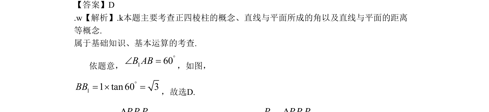

## 题面

## 摘要

本题主要考查正四棱柱中直线与平面所成角及距离的概念与计算。

## 关联考点

- [[1398-正四棱柱|正四棱柱]]
- [[1013-直线与平面所成的角|直线与平面所成的角]]
- [[1399-直线与平面的距离|直线与平面的距离]]

## 答案与解析

> 📄 原 PDF 第 3 页：`素材/真题/北京/2008-2024·（北京）数学高考真题/2009年高考数学试卷（文）（北京）（解析卷）.pdf`
