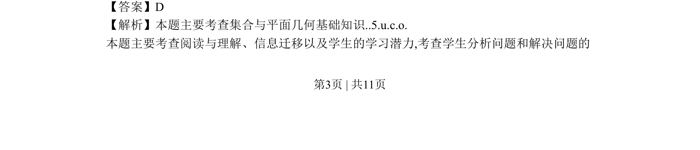
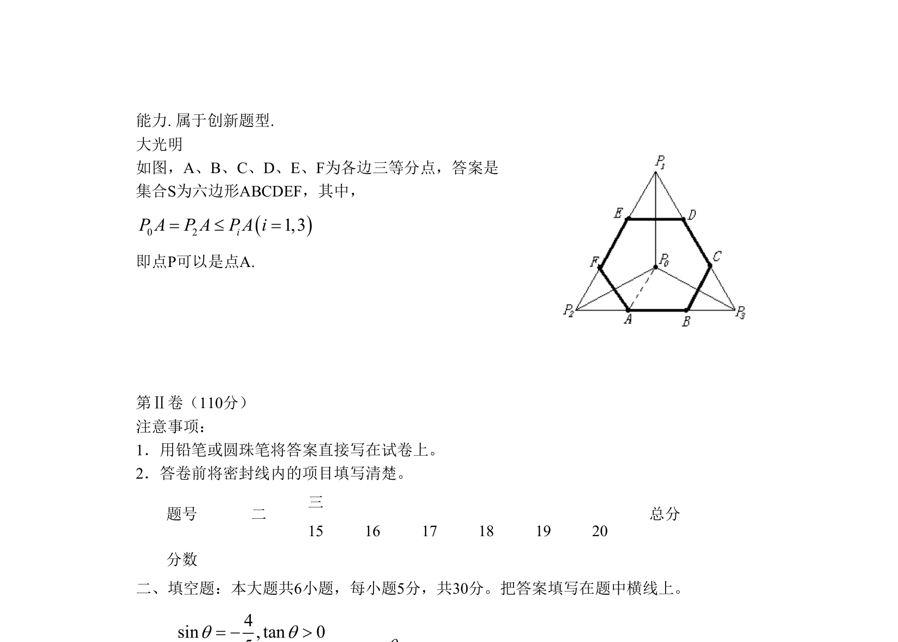

## 题面

## 摘要

考查集合与平面几何知识的创新题型，点P为六边形顶点。

## 关联考点

- [[042-集合|集合]]
- [[851-平面几何|平面几何]]
- [[创新题型]]

## 答案与解析

> 📄 原 PDF 第 3 页：`素材/真题/北京/2008-2024·（北京）数学高考真题/2009年高考数学试卷（文）（北京）（解析卷）.pdf`

<!-- 题干文本-start -->
## 题干文本
8．设D是正 及其内部的点构成的集合，点 是 的中心，若集合
，则集合S表示的平面区域是          (    )
A． 三角形区域                       B．四边形区域
C． 五边形区域                       D．六边形区域
<!-- 题干文本-end -->

<!-- 解析文本-start -->
## 解析文本
【答案】D
【解析】本题主要考查集合与平面几何基础知识..5.u.c.o. 
本题主要考查阅读与理解、信息迁移以及学生的学习潜力,考查学生分析问题和解决问题的
344 3 2 24A= ´ ´ =2 24 48´ =6pa=1cos 22a=6pa=1cos 2 cos3 2pa= =1cos 22a=()2 23 6k k k Zp pa p a p= + Þ = + Î()2 23 6k k k Zp pa p a p= - Þ = - Î1 1 1 1ABCD A B C D-1AB1 1A C3323160B AB°Ð =11 tan 60 3BB°= ´ =1 2 3PP PD0P1 2 3PP PD0{ | ,| | | |, 1, 2,3}iS P P D PP PP i= Î £ =
<!-- 解析文本-end -->
