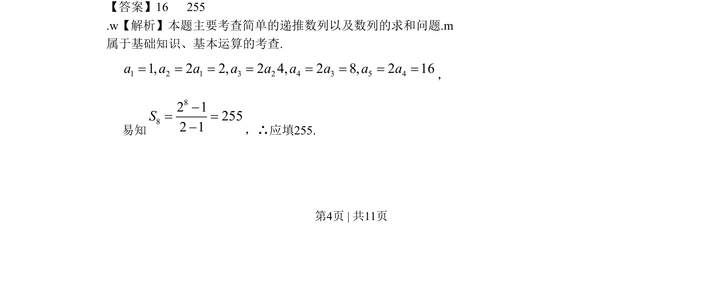

## 题面

## 摘要

本题给出递推公式求特定项和前8项和，考查等比数列通项与求和公式。

## 关联考点

- [[1067-等比数列的定义与通项公式|等比数列]]
- [[384-数列通项公式|通项公式]]
- [[713-前n项和公式|前n项和公式]]

## 答案与解析

> 📄 原 PDF 第 4 页：`素材/真题/北京/2008-2024·（北京）数学高考真题/2009年高考数学试卷（文）（北京）（解析卷）.pdf`
