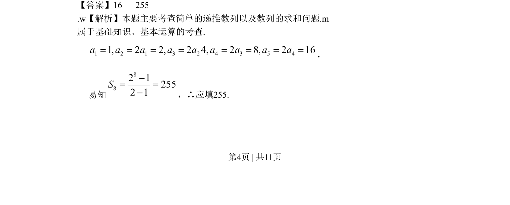

## 题面

## 摘要

本题给出递推公式求特定项和前8项和，考查等比数列通项与求和公式。

## 关联考点

- [[1067-等比数列的定义与通项公式|等比数列]]
- [[384-数列通项公式|通项公式]]
- [[713-前n项和公式|前n项和公式]]

## 答案与解析

> 📄 原 PDF 第 4 页：`素材/真题/北京/2008-2024·（北京）数学高考真题/2009年高考数学试卷（文）（北京）（解析卷）.pdf`

<!-- 题干文本-start -->
## 题干文本
10．若数列 满足： ，则           ；前8项的和
          .（用数字作答）
<!-- 题干文本-end -->

<!-- 解析文本-start -->
## 解析文本
【答案】16      255
.w【解析】本题主要考查简单的递推数列以及数列的求和问题.m       
属于基础知识、基本运算的考查.
     ，
     易知 ，∴应填255.
()0 21,3iP A P A P A i= £ =4sin , tan 05q q= - >cosq=35-q 224 3cos 1 sin 15 5q qæ ö= - - = - - - = -ç ÷è ø35-{ }na1 11, 2 ( )n na a a n N*+= = Î5a=8S=1 2 1 3 2 4 3 5 41, 2 2, 2 4, 2 8, 2 16a a a a a a a a a= = = = = = = =882 12552 1S-= =-
<!-- 解析文本-end -->
