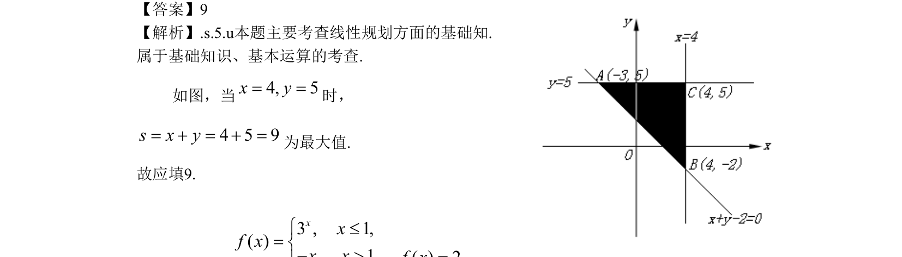

## 题面

## 摘要

本题以线性规划为背景，求目标函数在给定约束条件下的最大值。

## 关联考点

- [[1075-简单线性规划|线性规划]]
- [[1001-目标函数最值|目标函数最值]]
- [[1157-可行域|可行域]]

## 答案与解析

> 📄 原 PDF 第 5 页：`素材/真题/北京/2008-2024·（北京）数学高考真题/2009年高考数学试卷（文）（北京）（解析卷）.pdf`
