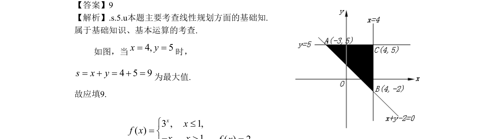

## 题面

## 摘要

本题以线性规划为背景，求目标函数在给定约束条件下的最大值。

## 关联考点

- [[1074-简单线性规划|线性规划]]
- [[1000-目标函数最值|目标函数最值]]
- [[1156-可行域|可行域]]

## 答案与解析

> 📄 原 PDF 第 5 页：`素材/真题/北京/2008-2024·（北京）数学高考真题/2009年高考数学试卷（文）（北京）（解析卷）.pdf`

<!-- 题干文本-start -->
## 题干文本
11．若实数 满足 则 的最大值为         .
<!-- 题干文本-end -->

<!-- 解析文本-start -->
## 解析文本
【答案】9
【解析】.s.5.u本题主要考查线性规划方面的基础知. 
属于基础知识、基本运算的考查.
         如图，当 时，
为最大值.
故应填9.
<!-- 解析文本-end -->
