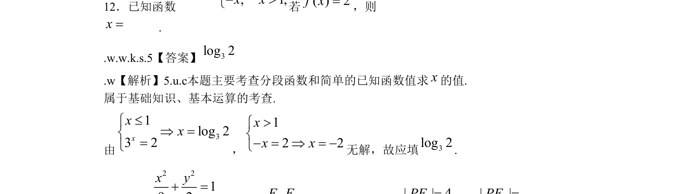

## 题面

## 摘要

考查分段函数已知函数值求自变量，涉及对数方程求解，属于基础知识。

## 关联考点

- [[290-分段函数|分段函数]]
- [[已知函数值求参]]
- [[832-对数运算|对数运算]]

## 答案与解析

> 📄 原 PDF 第 5 页：`素材/真题/北京/2008-2024·（北京）数学高考真题/2009年高考数学试卷（文）（北京）（解析卷）.pdf`
