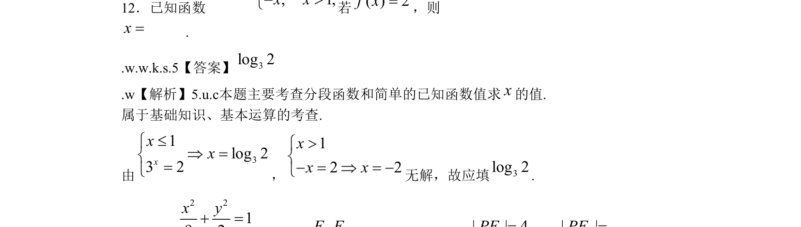

## 题面

## 摘要

考查分段函数已知函数值求自变量，涉及对数方程求解，属于基础知识。

## 关联考点

- [[290-分段函数|分段函数]]
- [[已知函数值求参]]
- [[832-对数运算|对数运算]]

## 答案与解析

> 📄 原 PDF 第 5 页：`素材/真题/北京/2008-2024·（北京）数学高考真题/2009年高考数学试卷（文）（北京）（解析卷）.pdf`

<!-- 题干文本-start -->
## 题干文本
12．已知函数 若 ，则
           .
.w.w.k.s.5
<!-- 题干文本-end -->

<!-- 解析文本-start -->
## 解析文本
【答案】
.w【解析】5.u.c本题主要考查分段函数和简单的已知函数值求 的值. 
属于基础知识、基本运算的考查.
由 ， 无解，故应填.
<!-- 解析文本-end -->
