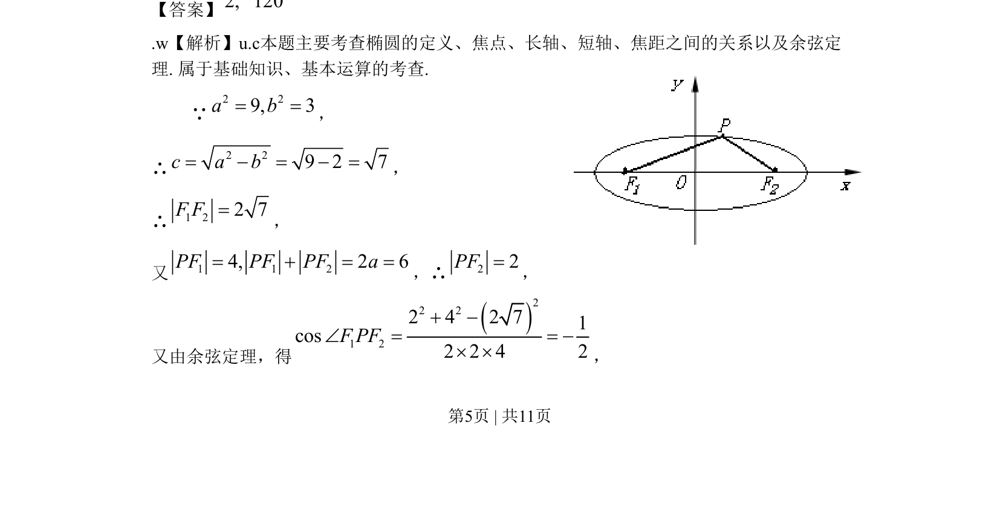
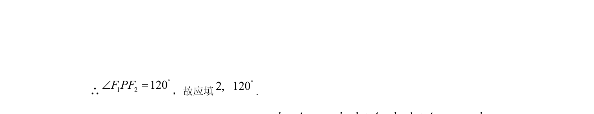

## 题面

## 摘要

本题结合椭圆定义与余弦定理，求椭圆上一点处的线段长与夹角。

## 关联考点

- [[1216-椭圆定义|椭圆定义]]
- [[941-椭圆标准方程|椭圆标准方程]]
- [[126-定理|余弦定理]]
- [[037-焦点焦距|焦点]]

## 答案与解析

> 📄 原 PDF 第 5 页：`素材/真题/北京/2008-2024·（北京）数学高考真题/2009年高考数学试卷（文）（北京）（解析卷）.pdf`
